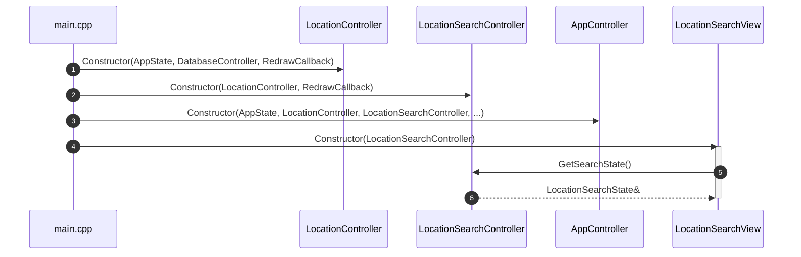
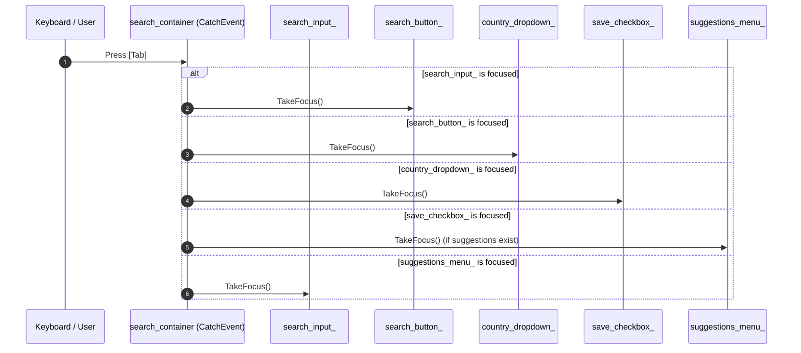
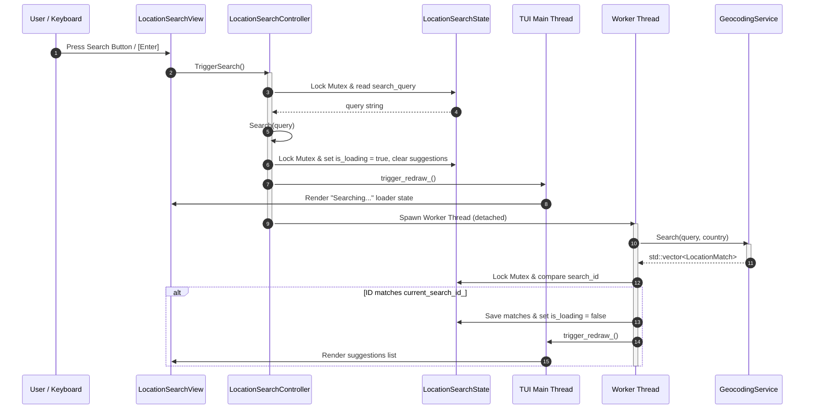
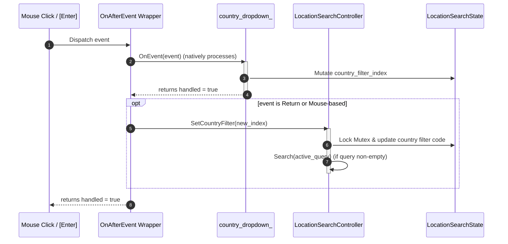
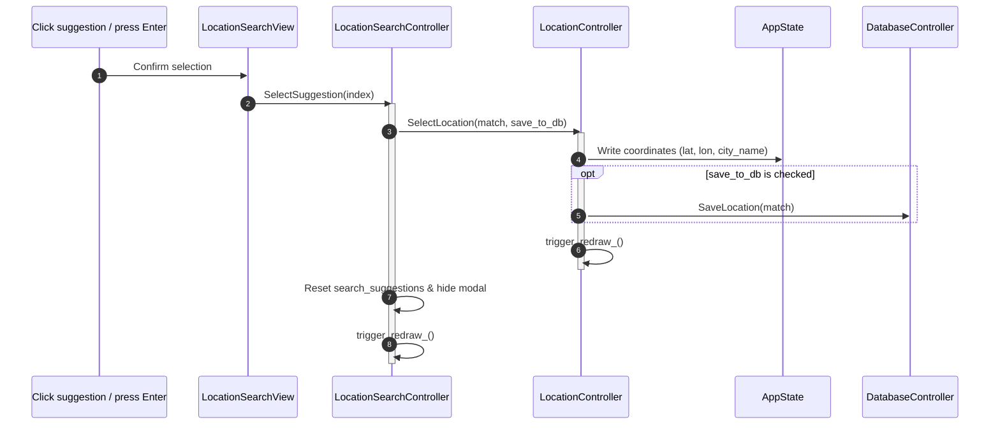

# Design Specification: LocationSearchView

This document provides a detailed design specification for the `LocationSearchView` modal in the `weather-cli` application, highlighting its FTXUI component layout, event routing, and sequence flows.

---

## 1. Component Hierarchy

`LocationSearchView` is designed using FTXUI's functional component pattern. To maintain hierarchical MVC separation, the View does not manage state mutations or threads. It delegates events to the `LocationSearchController` and binds read-only fields from `LocationSearchState` under mutex synchronization.

```
view_component_ (Renderer)
 └── search_container (Container::Vertical | CatchEvent decorator)
      ├── search_input_ (ftxui::Input)
      ├── search_button_ (ftxui::Button)
      ├── country_dropdown_ (ftxui::Dropdown wrapped in OnAfterEvent decorator)
      ├── save_checkbox_ (ftxui::Checkbox)
      └── suggestions_menu_ (ftxui::Menu)
```

---

## 2. Key Sequences & Flows

### A. Initialization Sequence

On application startup, views and controllers are wired hierarchically. The `LocationSearchView` receives a reference to `LocationSearchController` which itself holds a reference to `LocationController`.



---

### B. Keyboard Event & Focus Navigation Flow

The `search_container` intercepts keyboard events using a `CatchEvent` decorator to implement custom focus cycles and event routing:



---

### C. Search Invocation Sequence (Enter / Button Click)

When a search is explicitly triggered via a button click or pressing Enter inside the input box:



---

### D. Country Filter Order-of-Operations (OnAfterEvent Decorator)

Because dropdown selection changes natively update the bound index *during* event execution, a simple `CatchEvent` decorator executes too early (capturing the old index value). To resolve this, a custom `OnAfterEvent` decorator delegates the event to the dropdown component *first*, and only fires when the dropdown returns `handled = true`:



---

### E. Decoupled Location Selection Flow

When the user selects a matching suggestion, coordinates updates are decoupled from the search modal context. The search controller delegates coordinates changes to `LocationController` and clears modal variables:



---

## 3. Thread Safety & Mutex Boundaries

Since TUI layout rendering takes place on the main execution thread, any concurrent writes performed by background worker threads (e.g. updating suggestions vectors or loading states) must be isolated to prevent concurrent modification data races.

* **Main Thread (Render Loop)**:
  At the beginning of each `view_component_` rendering pass, a short critical section locks `LocationSearchState::mutex`, copies required values (`show_search_modal`, `is_loading`, `has_error`, `error_message`, and `search_suggestions`), and immediately releases the lock.
* **Background Thread (HTTP Geocoder)**:
  Locks `LocationSearchState::mutex` before writing fetched geocoding results, resetting suggestion cursor coordinates, or modifying loading flags.
