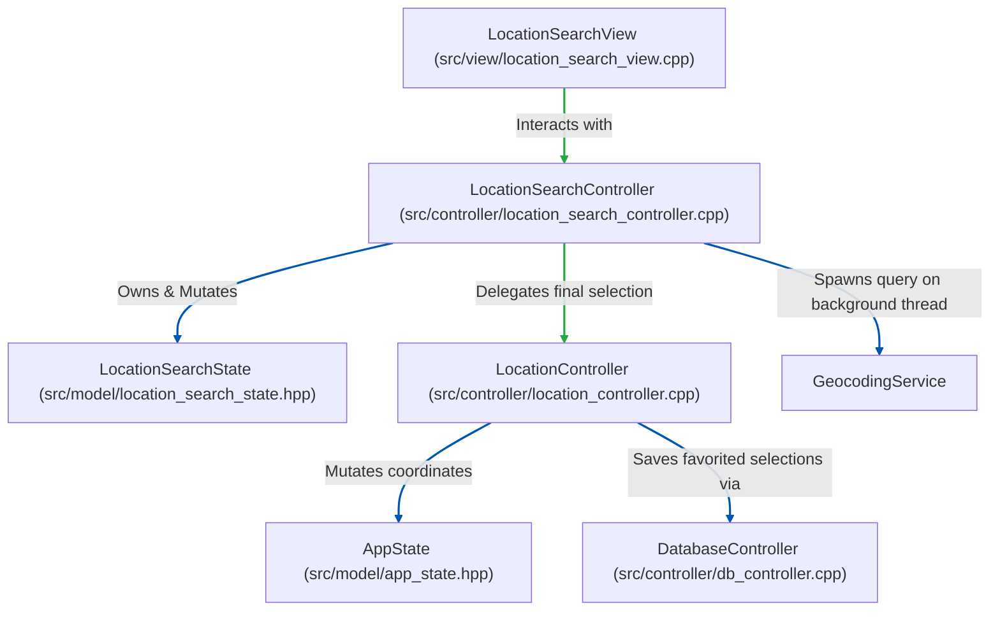

# Refactor Plan: LocationSearchController Isolation

This document outlines the step-by-step plan to refactor the search modal controller logic. Currently, `LocationController` manages both the core coord-selection state and the transient TUI geocoding inputs. This refactor decouples them by introducing a view-specific `LocationSearchController` that manages the geocoding state and delegates final coordinate selection to the core `LocationController`.

---

## 1. Architectural Changes

Below is a diagram of the target controller relationship:



### Responsibility Breakdown:
* **`LocationSearchController` (New)**:
  * Owns transient `LocationSearchState` (active query, dropdown entries, suggestions list, loading checks, errors).
  * Manages geocoding thread dispatch sequence IDs and cancels.
  * Handles country dropdown indexing and sync triggers.
  * Exposes modal triggers: `OpenSearch()`, `CancelSearch()`, `TriggerSearch()`, `SetCountryFilter()`.
* **`LocationController` (Existing)**:
  * Exposes core coordinate mutation logic: `void SelectLocation(const LocationMatch& location, bool save_to_db)`.
  * Manages coordinate-switching for saved locations: `void SelectSavedLocation(int index)`.
  * Integrates with `DatabaseController` to initialize and load/save locations.

---

## 2. Implementation Steps

### Step 1 — Create `LocationSearchController` (`src/controller/location_search_controller.hpp/.cpp`) ✅ Done
* [x] Create `src/controller/location_search_controller.hpp`:
  * Declare `LocationSearchController` class.
  * Member variables:
    * `LocationController& location_controller_`
    * `std::function<void()> trigger_redraw_`
    * `LocationSearchState search_state_`
    * `std::atomic<uint64_t> current_search_id_`
  * Declare constructor, getters for state, and modal control methods:
    * `Search(const std::string& query)`
    * `TriggerSearch()`
    * `SelectSuggestion(int index)`
    * `CancelSearch()`
    * `OpenSearch()`
    * `SetCountryFilter(int index)`
* [x] Create `src/controller/location_search_controller.cpp`:
  * Migrate geocoding thread worker logic and state mutations here from `location_controller.cpp`.
  * In `SelectSuggestion(int index)`, extract the chosen `LocationMatch` and call:
    `location_controller_.SelectLocation(match, search_state_.save_to_db);`

### Step 2 — Simplify `LocationController` ✅ Done
* [x] Clean up `src/controller/location_controller.hpp/.cpp`:
  * Remove `LocationSearchState search_state_` and `current_search_id_` members.
  * Remove geocoding search worker methods.
  * Add the delegate receiver method:
    ```cpp
    void SelectLocation(const LocationMatch& location, bool save_to_db);
    ```
    Implementation locks state mutex, writes coordinates/city name to `AppState`, delegates SQLite save to `db_controller_` if `save_to_db` is checked, clears search active states, and triggers redraw.

### Step 3 — Refactor `LocationSearchView` constructor & properties ✅ Done
* [x] In `src/view/location_search_view.hpp` and `.cpp`:
  * Accept `LocationSearchController&` instead of `LocationController&`.
  * Update all view interactions from `controller_.` to use `LocationSearchController`.

### Step 4 — Update `AppController` and global wiring ✅ Done
* [x] In `src/controller/app_controller.hpp/.cpp`:
  * Update constructor to take `LocationSearchController&` alongside `LocationController&` (or instantiate `LocationSearchController` internally inside `AppController` if appropriate).
  * Expose `LocationSearchController& GetSearchController()`.
* [x] In `src/main.cpp`:
  * Update instantiations wiring sequence:
    1. Instantiate `LocationController`.
    2. Instantiate `LocationSearchController` (injecting `LocationController`).
    3. Instantiate `AppController` (injecting sub-controllers).
    4. Instantiate `App` view (injecting `AppController`).

### Step 5 — CMake Integration ✅ Done
* [x] Update `CMakeLists.txt` to compile `src/controller/location_search_controller.cpp` under `controller_lib`.

### Step 6 — Separate Test Suites ✅ Done
* [x] Create `tests/controller/test_location_search_controller.cpp`:
  * Move modal search tests, suggestion selection triggers, `TriggerSearch()` validations, and `SetCountryFilter()` tests here.
* [x] Update `tests/controller/test_location_controller.cpp`:
  * Focus strictly on coordinate state mutation checks and favorites delegation paths.
* [x] Add `tests/controller/test_location_search_controller.cpp` to `run_tests` target in `CMakeLists.txt`.

---

## 3. Success Criteria

1. Incremental build (`cmake --build build`) runs successfully with no errors or warnings. ✅ Done
2. Headless Catch2 runner (`./build/run_tests`) passes all test cases (324 assertions). ✅ Done
3. The interactive weather TUI launches and behaves correctly:
   * Modal cycle navigations (`Tab`, `Esc`, `Enter`) continue to work.
   * Selecting locations updates the dashboard, and checking "Save to database" persists items.
   * Redraw loops execute with no delays or cursor flickering. ✅ Done
