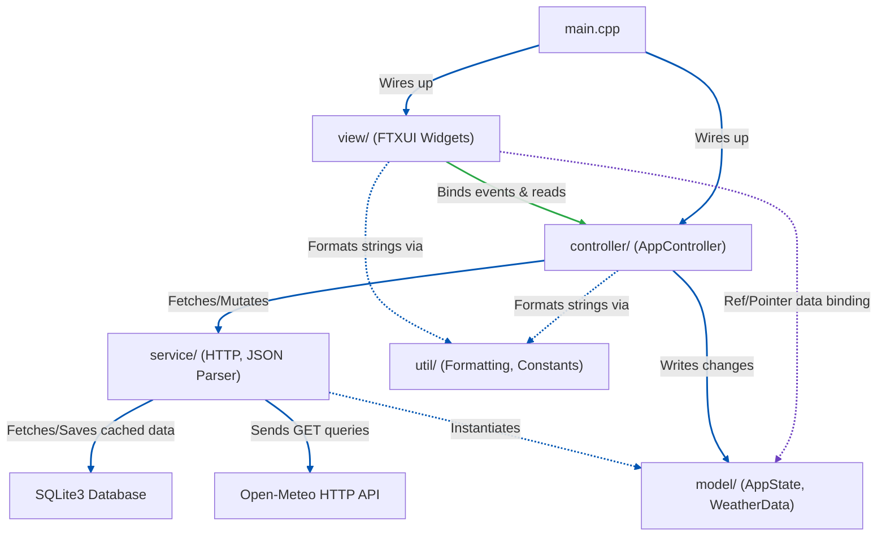

# Quick Weather CLI App Implementation Plan

A low-latency, terminal-based weather forecast utility built with **FTXUI**, fetching data via the **Open-Meteo API** (using **CPR**), parsing JSON with **nlohmann/json**, and implementing a clean **MVC + DDD architecture** similar to `calc-cli`.

This project conforms strictly to the [Google C++ Style Guide](https://google.github.io/styleguide/cppguide.html) with a project-local exception of **4-space indentation**.

---

## 1. Architectural Goals

- **Separation of Concerns**: Strictly divided layers: View (FTXUI presentation), Controller (event routing and coordination), Model (domain entities and TUI state), Service (external API fetching and parsing).
- **Enforced Dependencies**: Build-time dependency checks through separated CMake libraries: View $\rightarrow$ Controller $\rightarrow$ Service/Model $\rightarrow$ Utilities. View cannot bypass the Controller; Controller does not touch FTXUI directly.
- **Asynchronous Data Fetching**: API network calls (HTTP requests via CPR) must run on a background thread so the TUI render loop remains responsive.
- **Offline / Low-Latency Cache**: Use SQLite3 to cache forecasted data locally. Cache queries will have a time-to-live (TTL) check before falling back to network fetches.
- **Independent Testability**: Every component can be compiled and unit tested in isolation using Catch2 (e.g. testing the parser with mock JSON files, testing the controller state machine without FTXUI).

---

## 2. Directory Structure

```
weather-cli/
├── CMakeLists.txt                    # Root build configuration
├── .clang-format                     # Google C++ Style with 4-space indent
├── .gitignore                        # Standard git ignores (build/, CMake cache, IDEs)
├── CLAUDE.md                         # Quick reference commands for AI agents
├── README.md                         # Project description & overview
│
├── docs/
│   └── planning/
│       └── implementation/
│           └── weather-cli-impl-plan.md # This implementation plan
│
├── src/
│   ├── main.cpp                      # App entry point (wires layers, registers custom ftxui loop)
│   │
│   ├── model/                        # Domain entities and TUI state structures
│   │   ├── app_state.hpp             # Shared interactive state (active coordinates, timeline selection, unit settings)
│   │   ├── weather_data.hpp          # Domain entities: Forecast, CurrentWeather, HourlyData, DailyData
│   │   └── weather_data.cpp          # Domain logic definitions
│   │
│   ├── service/                      # Stateless infrastructure services
│   │   ├── http_client.hpp           # Wrapper for HTTP queries using CPR
│   │   ├── http_client.cpp           # Direct fetch methods with error checking
│   │   ├── weather_parser.hpp        # Translates Open-Meteo JSON into weather_data objects
│   │   └── weather_parser.cpp        # Decoupled nlohmann/json mapping
│   │
│   ├── controller/                   # Coordinator layer
│   │   ├── app_controller.hpp        # Controller class coordinating events
│   │   └── app_controller.cpp        # Handles city searches, timeline slider updates, unit toggles
│   │
│   ├── view/                         # FTXUI Views & components
│   │   ├── app.hpp                   # App View class
│   │   ├── app.cpp                   # Main FTXUI layout manager
│   │   ├── weather_icon.hpp          # ASCII art mappings based on WMO codes
│   │   ├── weather_icon.cpp          # Outputs multi-line weather icons
│   │   ├── sparkline_graph.hpp       # Custom canvas renderer for temperatures & rain charts
│   │   └── sparkline_graph.cpp       # FTXUI Canvas graphics plotter
│   │
│   └── util/                         # Static utilities, constants, formatting
│       ├── constants.hpp             # API URLs, default location coordinates (latitude, longitude)
│       ├── formatting.hpp            # Temperature/Wind speed converters, time formattings
│       └── formatting.cpp            # Formatting implementations
│
└── tests/                            # Unit and integration test suites
    ├── test_main.cpp                 # Catch2 runner
    ├── model/                        # Verify weather data entities
    ├── service/                      # Mock parser and API URL builder tests
    ├── controller/                   # Verify AppController handles input actions correctly
    ├── view/                         # Headless event injection verification
    └── util/                         # Formatting utility tests
```

### Layer Reference & Dependency Flow



---

## 3. UI Layout & View Details

The interface will split into four logical rows within FTXUI:
- **Header Control Row**: Search box for location names, unit switcher (Celsius/Fahrenheit toggle), and refresh button.
- **Main Status Row**: Multi-line weather icon in ASCII art, current temperature, description, humidity, and daily High/Low bounds.
- **Graph Visualization Row**: A custom FTXUI `Canvas` drawing line graphs for either temperature trend or precipitation probability.
- **Scrubber Timeline Row**: An interactive FTXUI `Slider` to scrub hourly forecast timelines (0 to 167 hours for 7 days), displaying the detailed weather metric for that selected hour beneath it.

### UI Mockup

```
┌────────────────────────────────────────────────────────┐
│  Quick Weather App - Sydney, AU   [ Refresh ] [ Units ]│ <- Top Header / Control Row
├────────────────────────────────────────────────────────┤
│   .------.      Current: 18.5°C                        │
│  /  /  / |      Condition: Light Rain                  │ <- ASCII Icon & Summary Panel
│   '------'      Wind: 14 km/h  Humidity: 85%           │
│  /  /  /        High: 21.0°C   Low: 12.5°C             │
├────────────────────────────────────────────────────────┤
│  Hourly Temperature Graph (Canvas)                     │
│  24°C ───  /\                                          │
│  20°C ──  /  \    /\                                   │ <- FTXUI Canvas (Sparkline)
│  16°C ─_ /    \__/  \                                  │
│  12°C ─             \______                            │
│        00:00   06:00   12:00   18:00                   │
├────────────────────────────────────────────────────────┤
│  Timeline Slider (Move cursor to scrub hours)          │
│  [ 09:00 ] ──────■───────────────────────────────      │ <- Slider timeline selector
├────────────────────────────────────────────────────────┤
│  Selected Hour Summary (09:00):                        │
│  Temp: 16.2°C  Rain Prob: 60%  Wind: 12km/h            │ <- Timeline details panel
└────────────────────────────────────────────────────────┘
```

---

## 4. CMake Build System Design

To prevent cross-layer leakage, CMake will partition compilation units into isolated libraries, matching the `calc-cli` library layout. To match `calc-cli`, the build system will enforce static linking of all libraries by specifying `STATIC` on all library targets and forcing `set(BUILD_SHARED_LIBS OFF CACHE BOOL "Build shared libraries" FORCE)` in the root configuration.


```cmake
# ---------------------------------------------------------------------------
# Libraries
# ---------------------------------------------------------------------------
# 1. util_lib: formatting and static constants
add_library(util_lib STATIC src/util/formatting.cpp)
target_include_directories(util_lib PUBLIC src/)

# 2. weather_lib: domain models + weather services (HTTP fetching, parsing)
add_library(weather_lib STATIC
    src/model/weather_data.cpp
    src/service/http_client.cpp
    src/service/weather_parser.cpp
)
target_include_directories(weather_lib PUBLIC src/)
target_link_libraries(weather_lib PUBLIC
    util_lib
    cpr::cpr
    nlohmann_json::nlohmann_json
    SQLite3::SQLite3
)

# 3. controller_lib: state machine coordinates
add_library(controller_lib STATIC src/controller/app_controller.cpp)
target_include_directories(controller_lib PUBLIC src/)
target_link_libraries(controller_lib PUBLIC weather_lib util_lib)

# 4. app_lib: view layout components (depends on FTXUI)
add_library(app_lib STATIC
    src/view/app.cpp
    src/view/weather_icon.cpp
    src/view/sparkline_graph.cpp
)
target_include_directories(app_lib PUBLIC src/)
target_link_libraries(app_lib PUBLIC
    ftxui::screen
    ftxui::dom
    ftxui::component
    controller_lib
)

# ---------------------------------------------------------------------------
# Executables
# ---------------------------------------------------------------------------
# Main app executable
add_executable(weather_cli src/main.cpp)
target_link_libraries(weather_cli PRIVATE app_lib)

# Catch2 test runner executable
add_executable(run_tests
    tests/test_main.cpp
    tests/util/test_formatting.cpp
    tests/model/test_weather_data.cpp
    tests/service/test_weather_parser.cpp
    tests/controller/test_app_controller.cpp
    tests/view/test_app.cpp
)
target_link_libraries(run_tests PRIVATE Catch2::Catch2WithMain app_lib controller_lib weather_lib)
```

---

## 5. Development Phases

### Phase 1 — Project Structure and Scaffold Configuration ✅ Done
- [x] Create skeleton folder structure under `src/` and `tests/` directories.
- [x] Set up basic repository configuration files: `.gitignore`, `.clang-format`, `CLAUDE.md`, and `README.md`.
- [x] Configure root `CMakeLists.txt` build configuration.
- [x] (No C++ `.cpp` or `.hpp` files will be created in this phase.)


### Phase 2 — Entry Point Scaffold (`main.cpp` only) ✅ Done
- [x] Create `src/main.cpp` with logic to support three operational modes:
  - [x] **Scenario 1: Headless CLI Parameters**: Accept `--area-code "<zip_or_code>"` and `--country "<country>"` arguments (e.g. `--area-code 2155 --country AUS`) and print the parsed inputs (area code and country) to the console.
  - [x] **Scenario 2: Headless Stdin Pipe**: Check if stdin is a pipe (`!isatty(STDIN_FILENO)`) and parse space-separated area and country values (e.g. `echo 2155 AUS | weather-cli`) and print the parsed inputs to the console.
  - [x] **Scenario 3: Interactive TUI (Stub)**: Fallback to launching an interactive FTXUI screen with a basic menu layout containing only a "Quit" option.
- [x] Temporarily configure root `CMakeLists.txt` to compile `src/main.cpp` directly, linking it only to FTXUI for bootstrapping (commenting out or excluding libraries that don't exist yet).
- [x] (No other C++ `.cpp` or `.hpp` source files will be created in this phase.)


### Phase 3 — TUI Outline Layout Setup (`AppState`, `AppController`, `App` View only) ✅ Done
- [x] Implement `src/model/app_state.hpp` defining the TUI state model (active coordinates, units configuration, active tab selection, scrubber indices).
- [x] Implement `src/controller/app_controller.hpp` and `src/controller/app_controller.cpp` coordinating core user actions (toggling Celsius/Fahrenheit, shifting tab selects, scrubbing timeline indices, exiting the loop).
- [x] Implement `src/view/app.hpp` and `src/view/app.cpp` building the visual wireframe:
  - [x] Top horizontal menu bar with options (Refresh, Units, Quit).
  - [x] Status banner showing mock city details.
  - [x] Summary row printing static condition text and mock ASCII icon clouds.
  - [x] View selectors for Temperature and Rain Probability graphs.
  - [x] A static FTXUI Canvas rendering horizontal lines to mockup the plotting area.
  - [x] Interactive slider timeline that scrubs indices (0 to 23).
  - [x] An hourly details box updating text metrics dynamically based on the active slider index.
- [x] Define the library targets (`util_lib`, `controller_lib`, `app_lib`) in `CMakeLists.txt` and link `weather_cli` executable to `app_lib`.
- [x] (No geocoding, HTTP network requests, parsing libraries, databases, custom canvas plotters, or WMO descriptions will be built in this phase. The UI components will render static mocked content.)


### Phase 4 — Geocoding Controller & Service (Locations Search API Integration) ✅ Done
- [x] Implement `src/service/http_client.hpp` and `src/service/http_client.cpp` using CPR to make GET requests to the Geocoding API.
- [x] Implement `src/service/geocoding_service.hpp` and `src/service/geocoding_service.cpp` to compose search query URLs, query the Open-Meteo search endpoint, and parse search results (extracting name, country, latitude, longitude, and region) using `nlohmann/json`.
- [x] Implement `src/controller/location_controller.hpp` and `src/controller/location_controller.cpp` to manage location searches (sending geocoding queries, performing fetches in a background thread to prevent TUI blocking, and updating suggestions array in `AppState`).
- [x] Add `LocationController` to `main.cpp` and update `CMakeLists.txt` build targets to link `http_client.cpp`, `geocoding_service.cpp`, and `location_controller.cpp`.
- [x] (No forecast API requests, sparkline canvas plotting, or ASCII icon renderers will be implemented in this phase. Weather coordinates changes will simply update the mock lat/lon numbers in the status panel.)


### Phase 5 — Geocoding & HTTP Client Service Tests ✅ Done
- [x] Create `tests/test_main.cpp` to configure the Catch2 test runner.
- [x] Create `tests/service/test_http_client.cpp` verifying standard network exception handling and invalid URL processing behaviors.
- [x] Create `tests/service/test_geocoding_service.cpp` testing JSON response parsing logic in isolation with mock JSON responses.
- [x] Enable the `run_tests` target in `CMakeLists.txt` linking it against `Catch2::Catch2WithMain`, `weather_lib`, and `util_lib`.
- [x] Build and execute the test runner to ensure all test suites pass.


### Phase 6 — Search Location Modal Dialog Integration ✅ Done
- [x] Implement focus management in `src/view/app.cpp` to call `search_input->TakeFocus()` dynamically in the Renderer loop when `state_.show_search_modal` transitions from `false` to `true`.
- [x] Connect input text modifications dynamically via `search_input_option.on_change = [this] { ... }` so typing a city name automatically triggers search requests.
- [x] Build a robust, thread-safe asynchronous search query sequence-matching mechanism in `LocationController` (using `std::atomic<uint64_t>`) to prevent network race conditions and thread leaks.
- [x] Render geocoding errors (e.g. connection errors) in the suggestions box in `src/view/app.cpp` when `state_.has_error` is `true`.
- [x] Handle dialog dismissal: verify that pressing `Esc` at any time inside the search modal closes the search dialog, clears temporary search state, and restores focus to the main interface.
- [x] Ensure selection triggers coordinates update, resets search state, closes modal, and triggers a redraw.
- [x] Add unit tests in `tests/controller/test_location_controller.cpp` to verify search triggering and state updates.

### Phase 7 — Modal Dialog View/Controller/State Refactoring (MVC Isolation) ✅ Done
- [x] Create `src/model/location_search_state.hpp` containing `LocationSearchState` (query, suggestions, loading, errors, and its own local mutex) to completely decouple search state from the global `AppState`.
- [x] Remove all transient modal search variables and mutex properties from `AppState` in `src/model/app_state.hpp`.
- [x] Update `LocationController` to own and manage the lifecycle of `LocationSearchState`, updating `AppState` only with the chosen coordinate values upon selected suggestions.
- [x] Create `src/view/location_search_view.hpp` and `src/view/location_search_view.cpp` to fully encapsulate the search input, suggestions menu, modal rendering layouts, focus captures, and `Esc`/`Return` key event handlers.
- [x] Refactor `App` views inside `src/view/app.hpp` and `src/view/app.cpp` to delegate search modal rendering and key interceptions to `LocationSearchView`, completely clearing out search UI logic from the main application view.
- [x] Update `CMakeLists.txt` to compile `location_search_view.cpp` into `app_lib`.
- [x] Update tests in `tests/controller/test_location_controller.cpp` to compile and pass with the new isolated state pattern.

### Phase 8 — Architectural Separation of Concerns Documentation ✅ Done
- [x] Create `docs/separation-of-concerns.md` detailing the architectural layers of the `weather-cli` application, including a Mermaid interaction diagram, detailed layer boundaries, sub-controller flows, state structures, and design style guidelines.

### Phase 9 — Hierarchical MVC Refactor & Missing Test Cases Coverage ✅ Done
- [x] Refactor `AppController` in `src/controller/app_controller.hpp` and `src/controller/app_controller.cpp` to take `LocationController&` in its constructor, add an `OpenSearch()` delegation method, and expose a getter to retrieve `LocationController`.
- [x] Refactor `App` in `src/view/app.hpp` and `src/view/app.cpp` to remove its dependency on `LocationController` (only takes `AppController&` and `AppState&`).
- [x] Update `App` to initialize `location_search_view_` using `controller.GetLocationController()`.
- [x] Route Locations menu triggers and modal visibility checks in `src/view/app.cpp` through `AppController`.
- [x] Update object construction wiring in `src/main.cpp` to initialize controllers hierarchically.
- [x] Create `tests/util/test_formatting.cpp` to verify temperature converters (Celsius/Fahrenheit) and time format utility methods.
- [x] Create `tests/controller/test_app_controller.cpp` to verify `AppController` units toggle state, tab shifts, timeline slider index updates, and coordination/delegation to `LocationController`.
- [x] Create `tests/view/test_app.cpp` to verify root View components initialize correctly, root tab defaults, and components getters behave gracefully without throwing exceptions.
- [x] Update `CMakeLists.txt` to compile all new test source files (`test_formatting.cpp`, `test_app_controller.cpp`, `test_app.cpp`) in `run_tests`.
- [x] Update the `docs/separation-of-concerns.md` document diagrams to reflect the strict 1-to-1 View-to-Controller bindings.

### Phase 10 — App Version and Standalone About/Version Modal View ✅ Done
- [x] Add version and app name constants to `constants.hpp`.
- [x] Create standalone `AboutState`, `AboutController`, and `AboutView`.
- [x] Refactor `AppController` and `App` to inject and use `AboutController` / `AboutView` hierarchically.
- [x] Update unit tests and register files in `CMakeLists.txt` and `docs/separation-of-concerns.md`.

### Phase 11 — Locations Database Integration (SQLite3) ✅ Done
- [x] **Database Model & Controller Setup**:
  - [x] Create `src/model/location_repository.hpp` defining the `LocationRepository` struct holding `std::vector<LocationMatch> saved_locations`.
  - [x] Create `src/controller/db_controller.hpp` and `src/controller/db_controller.cpp` defining `DatabaseController`.
  - [x] `DatabaseController` handles establishing database connections, executing the SQL schema initialization, and querying/saving locations directly into `LocationRepository`.
- [x] **State & Controller updates**:
  - [x] Add `save_to_db` flag to [LocationSearchState](file:///Users/mattswart/Source/CPP/weather-cli/src/model/location_search_state.hpp).
  - [x] Inject `DatabaseController&` into [LocationController](file:///Users/mattswart/Source/CPP/weather-cli/src/controller/location_controller.hpp) and [AppController](file:///Users/mattswart/Source/CPP/weather-cli/src/controller/app_controller.hpp).
  - [x] Update `LocationController::SelectSuggestion` to delegate saving selected location to `DatabaseController` when `save_to_db` is checked.
  - [x] Implement `AppController::SelectSavedLocation(int saved_index)` to coordinate selection of saved database locations.
- [x] **View Overlay & Dynamic Dropdown**:
  - [x] Add a `save_to_db` Checkbox component inside [LocationSearchView](file:///Users/mattswart/Source/CPP/weather-cli/src/view/location_search_view.hpp).
  - [x] Rebuild `locations_entries_` dynamically inside [app.cpp](file:///Users/mattswart/Source/CPP/weather-cli/src/view/app.cpp) based on `LocationRepository::saved_locations` contents, starting with no entries until saved.
  - [x] Route dropdown clicks to `SelectSavedLocation` or `OpenSearch` dynamically.
- [x] **Unit Tests & Integration**:
  - [x] Create `tests/controller/test_db_controller.cpp` to verify SQLite CRUD queries and state updates.
  - [x] Register new files in [CMakeLists.txt](file:///Users/mattswart/Source/CPP/weather-cli/CMakeLists.txt) and update diagrams in [separation-of-concerns.md](file:///Users/mattswart/Source/CPP/weather-cli/docs/separation-of-concerns.md).

### Phase 12 — Refactor Database Controller & LocationRepository (Repository Pattern) ✅ Done
- [x] **Define SQL Schema and Table Constants**:
  - [x] Add `constexpr std::string_view` constants in `src/util/constants.hpp` for the database table name (`saved_locations`) and columns (`name`, `country`, `region`, `latitude`, `longitude`).
- [x] **Convert `LocationRepository` to a Database-backed Class**:
  - [x] Refactor `src/model/location_repository.hpp` to define `LocationRepository` as a class that accepts a database path in its constructor and holds the `sqlite3* db_` connection handle.
  - [x] Move query logic, SQL strings, and execution from `DatabaseController` into `LocationRepository`. Use `std::format` to format all queries.
  - [x] Implement query caching inside `LocationRepository` to maintain the in-memory `std::vector<LocationMatch>` favorites vector.
- [x] **Thin Out `DatabaseController`**:
  - [x] Refactor `src/controller/db_controller.hpp/cpp` to accept a `LocationRepository&` reference.
  - [x] Delegate initialization, loading, and saving methods directly to the underlying `LocationRepository` class.
- [x] **Unit Tests & Test SQLite Cleanup**:
  - [x] Update `tests/controller/test_db_controller.cpp` to pass `":memory:"` as the database path, verifying operations in-memory without polluting the project root directory with test databases.
  - [x] Ensure all 10 unit test cases compile and pass correctly.
- [x] **Documentation Updates**:
  - [x] Update diagrams and layer descriptions in `docs/separation-of-concerns.md` to reflect SQL ownership inside `LocationRepository`.

### Phase 12.1 — Keyboard Focus Fix for Search Dialog Checkbox ✅ Done
- [x] **Tab Navigation Focus Traversal**:
  - [x] Update key event dispatching inside `src/view/location_search_view.cpp`.
  - [x] Handle `Event::Tab` to cycle focus forward: search input $\rightarrow$ search suggestions menu (if suggestions exist) $\rightarrow$ save to DB checkbox $\rightarrow$ search input.
  - [x] Handle `Event::TabReverse` to cycle focus backward: search input $\rightarrow$ save to DB checkbox $\rightarrow$ search suggestions menu (if suggestions exist) $\rightarrow$ search input.
- [x] **Input Box Styling**:
  - [x] Refactor input box renderer inside `src/view/location_search_view.cpp` to use black background (`bgcolor(Color::Black)`) and green text (`color(Color::Green)`).
- [x] **Modal Rendering and Verification**:
  - [x] Update visual labels or instructions in the footer of the search modal to clarify keyboard options (e.g., adding `[Tab] Cycle Focus`).
  - [x] Verify that navigating and toggling is fully operational via keyboard commands.

### Phase 12.2 — Layout Navigation Alignment & Input Cursor Fix ✅ Done
- [x] **Align Focus Order with Visual Layout**:
  - [x] Update `search_container` in `src/view/location_search_view.cpp` to lay out components as: Input $\rightarrow$ Checkbox $\rightarrow$ Suggestions List.
  - [x] Adjust `event_dispatcher` to handle `ArrowUp`/`ArrowDown`/`Tab`/`TabReverse` in this exact visual sequence.
- [x] **Fix Editing Cursor Visibility**:
  - [x] Add `cursor_position` tracking inside `LocationSearchState`.
  - [x] Bind cursor position pointer to `search_input_option.cursor_position`.
  - [x] Reset `cursor_position = 0` inside `LocationController` during modal state transitions (Select, Cancel, Open) to prevent cursor clipping.
  - [x] Style cursor highlight naturally by removing background color overrides from the text input transform.

### Phase 13 — CLI Postcode + Country Geocoding Lookup ✅ Done
Wire the existing headless CLI path in `main.cpp` to actually call the geocoding
service when `--area-code` and `--country` are provided, resolve the location,
print it to stdout, and exit — no TUI launched.

**Example invocation:**
```bash
./weather_cli --area-code 2153 --country AU
```
**Expected console output:**
```
Resolved location:
  City:    Baulkham Hills
  Region:  New South Wales
  Country: Australia
  Lat:     -33.7667
  Lon:     151.0000
```

- [x] **Step 13.1** — Extend `GeocodingService::Search` signature:
  - [x] Add `const std::string& country_code = ""` default parameter to `Search` in `src/service/geocoding_service.hpp`.
  - [x] Append `&countryCode=<code>` to the URL in `geocoding_service.cpp` when `country_code` is non-empty.
  - [x] Existing `LocationController` call (no country code) is unaffected via default arg.
- [x] **Step 13.2** — Wire geocoding into headless CLI path in `main.cpp`:
  - [x] Add `#include "service/geocoding_service.hpp"` to `main.cpp`.
  - [x] Replace the echo stub (`std::cout << "Area Code: ..."`) with a real synchronous `GeocodingService::Search(area_code, country)` call.
  - [x] Print resolved `LocationMatch` fields (name, region, country, latitude, longitude) to stdout.
  - [x] Print an error to stderr and return `EXIT_FAILURE` when no results are found.
- [x] **Step 13.3** — Build and manual test:
  - [x] `./weather_cli --area-code 2153 --country AU` → Baulkham Hills, NSW, Australia.
  - [x] `./weather_cli --area-code 90210 --country US` → Beverly Hills, California.
  - [x] `./weather_cli --area-code 99999 --country ZZ` → error + exit code 1.
  - [x] `echo "2153 AU" | ./weather_cli` → same Baulkham Hills output (stdin pipe path covered by same fix).
  - [x] `./weather_cli` (no args) → TUI launches normally (regression check).
- [x] **Step 13.4** — Update `README.md`:
  - [x] Add a **CLI Usage** section documenting the `--area-code` and `--country` flags.
  - [x] Explicitly state that `--country` requires an **ISO 3166-1 alpha-2** code (2-letter, e.g. `AU`, `US`, `GB`) — alpha-3 codes (`AUS`) are not accepted.
  - [x] Include a usage example showing `--area-code 2153 --country AU` and the expected output.
  - [x] Include a stdin pipe example: `echo "2153 AU" | weather_cli`.

**Files changed:** `geocoding_service.hpp`, `geocoding_service.cpp`, `main.cpp`, `README.md` — no new files, no CMake changes.

> **Note:** Country codes must be ISO 3166-1 alpha-2 (`AU`, `US`, `GB`). The API does not accept alpha-3 (`AUS`).

---

### Phase 14 — Postcode Geocoding Fallback Integration (Zippopotam.us) ✅ Done
Because the Open-Meteo Geocoding API does not consistently map postcodes (especially outside Europe/US like Australia), we will integrate `api.zippopotam.us` as a fallback for strictly numeric query strings when a country code is provided.

- [x] **Step 14.1** — Implement Query Type Detection:
  - [x] Add a helper utility (e.g. `is_numeric()`) in `src/service/geocoding_service.cpp` to determine if a search query string contains only digits.
- [x] **Step 14.2** — Implement Zippopotam.us API Integration:
  - [x] If the query is purely numeric AND the `country_code` is provided, route the `HttpClient::Fetch` call to `https://api.zippopotam.us/{country_code}/{query}` (ensuring country code is properly lowercased/formatted).
  - [x] Otherwise, route to the existing Open-Meteo API.
- [x] **Step 14.3** — Implement Zippopotam.us JSON Parsing:
  - [x] Create a new private parser method `ParseZippopotamResponse(const std::string& json_str)` inside `GeocodingService` to handle the different JSON structure.
  - [x] Map the Zippopotam keys `{"place name", "state", "country abbreviation", "latitude", "longitude"}` to our `LocationMatch` struct.
  - [x] Update `GeocodingService::Search` to return the results from this parser if Zippopotam was queried.
  - [x] If the Zippopotam fetch fails (e.g., 404 Not Found), fail gracefully by returning an empty vector.
- [x] **Step 14.4** — Update Tests:
  - [x] Add a Catch2 test case in `tests/service/test_geocoding_service.cpp` to verify parsing of a mock Zippopotam.us JSON response.
  - [x] Run `./build/run_tests` to verify parsing correctness.
- [x] **Step 14.5** — Manual Verification:
  - [x] Re-run `./build/weather_cli --area-code 2153 --country AU` and confirm it prints `Baulkham Hills, New South Wales, AU` (or similar).

### Phase 15 — CLI City Name Geocoding Lookup ✅ Done
Add support for searching by city name via the CLI using a new `--city` flag (e.g., `./weather_cli --city "Baulkham Hills" --country AU`).

- [x] **Step 15.1** — Update CLI Argument Parsing in `main.cpp`:
  - [x] Add support for parsing the `--city` argument.
  - [x] Consolidate the CLI logic so that either `--city` or `--area-code` supplies the search query to `GeocodingService::Search(query, country)`.
  - [x] Update error outputs to reflect whether the user searched for a city or an area code.
- [x] **Step 15.2** — Build and Manual Test:
  - [x] Test `./build/weather_cli --city "Baulkham Hills" --country AU` → Baulkham Hills, NSW, Australia.
  - [x] Test `./build/weather_cli --city "London" --country GB` → London, England, UK.
- [x] **Step 15.3** — Update `README.md`:
  - [x] Document the new `--city` flag in the CLI Usage section.
  - [x] Provide an example using the `--city` flag with a multi-word city name wrapped in quotes.

### Phase 16.1 — Current Conditions Fetch & Icon Rendering ✅ Done
Wire the Open-Meteo API for live current conditions and drive the ASCII icon in the summary panel from `weather_icons.hpp` using the returned WMO weather code.

#### Step 16.1.1 — Add Forecast API Constants (`constants.hpp`) ✅ Done
- [x] Add forecast URL and query parameter constants to `src/util/constants.hpp`:
  - [x] `kForecastApiEndpoint` — `"https://api.open-meteo.com/v1/forecast"` (replaces/unifies existing `kApiEndpoint`).
  - [x] `kCurrentParams` — comma-separated current fields: `temperature_2m`, `relative_humidity_2m`, `wind_speed_10m`, `weather_code`, `apparent_temperature`.
  - [x] `kDailyParams` — `temperature_2m_max`, `temperature_2m_min`.
  - [x] `kForecastTimeZone` — `"auto"`.
- [x] **Files changed:** `src/util/constants.hpp` only.

#### Step 16.1.2 — Define `CurrentConditions` Domain Struct (`weather_data.hpp/.cpp`) ✅ Done
- [x] Create `src/model/weather_data.hpp` defining the `CurrentConditions` struct:
  - [x] `double temperature` — current temperature in °C.
  - [x] `double feels_like` — apparent temperature in °C.
  - [x] `int humidity` — relative humidity %.
  - [x] `double wind_speed` — wind speed in km/h.
  - [x] `int weather_code` — WMO weather interpretation code.
  - [x] `double daily_max` — today's forecast high in °C.
  - [x] `double daily_min` — today's forecast low in °C.
- [x] Create `src/model/weather_data.cpp` (initially empty / stub definition file).
- [x] **Files changed:** `src/model/weather_data.hpp` (new), `src/model/weather_data.cpp` (new).

#### Step 16.1.3 — WMO Code → Icon & Description Mapping (`weather_icon.hpp/.cpp`) ✅ Done
- [x] Create `src/view/weather_icon.hpp` declaring `WeatherIcon` with two static methods:
  - [x] `static const std::vector<std::string>& GetIcon(int wmo_code)` — returns the matching icon constant from `weather_icons.hpp`.
  - [x] `static std::string GetDescription(int wmo_code)` — returns a human-readable condition string.
- [x] Create `src/view/weather_icon.cpp` implementing WMO grouping logic:
  - [x] `0` → `kSunny`, `"Clear Sky"`
  - [x] `1, 2` → `kSunny`, `"Mainly Clear"` / `"Partly Cloudy"`
  - [x] `3` → `kCloudy`, `"Overcast"`
  - [x] `45, 48` → `kCloudy`, `"Foggy"`
  - [x] `51–57` → `kRainy`, `"Drizzle"`
  - [x] `61–67` → `kRainy`, `"Light Rain"` / `"Rain"` / `"Heavy Rain"`
  - [x] `71–77` → `kSnowy`, `"Snow"`
  - [x] `80–82` → `kRainy`, `"Rain Showers"`
  - [x] `85, 86` → `kSnowy`, `"Snow Showers"`
  - [x] `95` → `kStormy`, `"Thunderstorm"`
  - [x] `96, 99` → `kStormy`, `"Thunderstorm w/ Hail"`
  - [x] _(fallback)_ → `kCloudy`, `"Unknown"`
- [x] **Files changed:** `src/view/weather_icon.hpp` (new), `src/view/weather_icon.cpp` (new).

#### Step 16.1.4 — Implement `WeatherService::FetchCurrentConditions` (`weather_service.hpp/.cpp`) ✅ Done
- [x] Create `src/service/weather_service.hpp` declaring `WeatherService` with:
  - [x] `static std::optional<CurrentConditions> FetchCurrentConditions(double latitude, double longitude)`.
  - [x] Private `static CurrentConditions ParseCurrentConditions(const std::string& json_str)`.
- [x] Create `src/service/weather_service.cpp`:
  - [x] Compose the Open-Meteo forecast URL using `std::format` and the constants from Step 16.1.1.
  - [x] Call `HttpClient::Fetch` (existing) to make the GET request.
  - [x] Parse the `current` and `daily` JSON blocks via `nlohmann/json` into `CurrentConditions`.
  - [x] Return `std::nullopt` on network error or parse exception (catch and swallow).
- [x] **Files changed:** `src/service/weather_service.hpp` (new), `src/service/weather_service.cpp` (new).

#### Step 16.1.5 — `ForecastController` Sub-Controller & `AppState` Extension ✅ Done
- [x] Add `std::optional<CurrentConditions> current_conditions = std::nullopt` to `src/model/app_state.hpp`.
- [x] Create `src/controller/forecast_controller.hpp` and `src/controller/forecast_controller.cpp`:
  - [x] Constructor takes `AppState&`.
  - [x] `void Refresh()` — sets `state_.is_loading = true`, spawns a background thread that calls `WeatherService::FetchCurrentConditions(state_.latitude, state_.longitude)`, writes result into `state_.current_conditions`, clears `state_.is_loading`. Uses an `std::atomic<uint64_t>` sequence counter (same pattern as `LocationController`) to discard stale responses.
- [x] Update `src/controller/app_controller.hpp` and `src/controller/app_controller.cpp`:
  - [x] Take `ForecastController&` in the constructor.
  - [x] `RefreshForecast()` now delegates to `forecast_controller_.Refresh()`.
  - [x] Expose `ForecastController& GetForecastController()`.
- [x] Update `src/main.cpp`:
  - [x] Instantiate `ForecastController` and wire it into `AppController`.
  - [x] Call `forecast_controller.Refresh()` once on startup (triggers the first background fetch).
- [x] **Files changed:** `src/model/app_state.hpp`, `src/controller/forecast_controller.hpp` (new), `src/controller/forecast_controller.cpp` (new), `src/controller/app_controller.hpp`, `src/controller/app_controller.cpp`, `src/main.cpp`.

#### Step 16.1.6 — Wire Live Data Into the Summary Panel (`app.cpp`) ✅ Done
- [x] Replace all three hardcoded mock variables in the summary panel in `src/view/app.cpp` with values from `state_.current_conditions` (`std::optional`), falling back to `0.0` / `0` when `nullopt`:
  - [x] `current_temp`, `max_temp`, `min_temp`, `humidity`, `wind_speed_v`, `wmo_code`.
- [x] Replace the static `icons::kRainy` icon with `WeatherIcon::GetIcon(wmo_code)`.
- [x] Replace the hardcoded `"Condition: Light Rain"` string with `"Condition: " + WeatherIcon::GetDescription(wmo_code)`.
- [x] Replace the mock wind speed calculation (`8 + (selected_hour * 2) % 20`) in the summary panel with `cc->wind_speed` (hourly slider mock values stay — those are Phase 16.2 scope).
- [x] Show `"Loading..."` in the condition line when `state_.is_loading` is `true`.
- [x] Add `#include "view/weather_icon.hpp"` to `src/view/app.hpp`.
- [x] **Files changed:** `src/view/app.cpp`, `src/view/app.hpp`.

#### Step 16.1.7 — CMake Integration & Tests ✅ Done
- [x] Update `CMakeLists.txt`:
  - [x] Add `src/model/weather_data.cpp` and `src/service/weather_service.cpp` to `weather_lib`.
  - [x] Add `src/controller/forecast_controller.cpp` to `controller_lib`.
  - [x] Add `src/view/weather_icon.cpp` to `app_lib`.
  - [x] Add four new test source files to `run_tests`.
- [x] Create `tests/model/test_weather_data.cpp` — verify `CurrentConditions` struct default-initialises correctly.
- [x] Create `tests/service/test_weather_service.cpp` — verify `ParseCurrentConditions` with mock JSON strings (valid response, missing fields, malformed JSON).
- [x] Create `tests/controller/test_forecast_controller.cpp` — verify `Refresh()` writes `CurrentConditions` into `AppState`; verify stale fetch is discarded via sequence counter.
- [x] Create `tests/view/test_weather_icon.cpp` — verify `GetIcon()` returns correct icon vector for representative WMO codes; verify `GetDescription()` returns correct strings; verify fallback for unknown code.
- [x] Build (`cmake --build build`) and run (`./build/run_tests`) — all tests green.
- [x] **Files changed:** `CMakeLists.txt`, 4 new test files under `tests/`.


### Phase 16.2 — Country Filter in Location Search Modal ✅ Done

Wire a country filter dropdown/selector into the existing location search modal so that city queries are scoped to a selected country. Default to **Australia (AU)**. The `GeocodingService::Search` already accepts a `country_code` parameter — this phase surfaces it in the UI through a clean model → controller → view path.

---

#### Step 16.2.1 — Extend `LocationSearchState` with Country Filter Fields ✅ Done
- [x] Add the following fields to `struct LocationSearchState` in `src/model/location_search_state.hpp`:
  - [x] `std::string country_filter = "AU"` — ISO 3166-1 alpha-2 code passed to `GeocodingService::Search`. Defaults to Australia.
  - [x] `int country_filter_index = 0` — tracks which entry is selected in the FTXUI dropdown menu (index into `kCountryList`).
- [x] **Files changed:** `src/model/location_search_state.hpp`.

#### Step 16.2.2 — Add Country List Constant (`constants.hpp`) ✅ Done
- [x] Add a `constexpr` ordered array / `std::array` of `{display_label, iso_code}` pairs to `src/util/constants.hpp`:
  ```cpp
  struct CountryEntry { std::string_view label; std::string_view code; };
  constexpr std::array<CountryEntry, N> kCountryList = {{
      {"Australia",      "AU"},
      {"United States",  "US"},
      {"United Kingdom", "GB"},
      {"Canada",         "CA"},
      {"New Zealand",    "NZ"},
      {"Germany",        "DE"},
      {"France",         "FR"},
      {"Japan",          "JP"},
      {"India",          "IN"},
      {"Brazil",         "BR"},
      {"Any Country",    ""},   // empty string → no country filter
  }};
  ```
  - [x] `kCountryList[0]` must be `"AU"` so the default index `0` maps to Australia.
- [x] **Files changed:** `src/util/constants.hpp`.

#### Step 16.2.3 — Wire Country Filter Into `LocationController::Search` ✅ Done
- [x] Update `LocationController::Search(const std::string& query)` in `src/controller/location_controller.cpp`:
  - [x] Read `search_state_.country_filter` (under the mutex) before dispatching the background thread.
  - [x] Snapshot it into a local `const std::string country` variable alongside `query` and `search_id`.
  - [x] Pass `country` as the second argument to `GeocodingService::Search(query, country)`.
- [x] **No change to the public `Search(query)` signature** — the controller reads `country_filter` from its own state, keeping the caller API stable.
- [x] **Files changed:** `src/controller/location_controller.cpp`.

#### Step 16.2.4 — Sync Dropdown Selection to `country_filter` in `LocationController` ✅ Done
- [x] Add a new public method to `LocationController`:
  ```cpp
  void SetCountryFilter(int index);
  ```
  - [x] Validates `index` is within `kCountryList` bounds.
  - [x] Under the mutex: sets `search_state_.country_filter_index = index` and `search_state_.country_filter = std::string(kCountryList[index].code)`.
  - [x] If `search_state_.search_query` is non-empty, re-triggers `Search(search_state_.search_query)` so results immediately re-filter.
- [x] Declare `SetCountryFilter` in `src/controller/location_controller.hpp`.
- [x] **Files changed:** `src/controller/location_controller.hpp`, `src/controller/location_controller.cpp`.

#### Step 16.2.5 — Add Country Dropdown to `LocationSearchView` ✅ Done
- [x] In `LocationSearchView` (`src/view/location_search_view.cpp` / `.hpp`):
  - [x] Add a `std::vector<std::string> country_entries_` member — populated once in the constructor from `kCountryList` display labels.
  - [x] Add a `ftxui::Component country_dropdown_` member — created with `ftxui::Dropdown(&country_entries_, &search_state.country_filter_index)`.
  - [x] Register an `on_change` callback on the dropdown that calls `controller_.SetCountryFilter(search_state.country_filter_index)`.
  - [x] Insert `country_dropdown_` into the `Container::Vertical` between the search input and the save checkbox (tab order: input → country dropdown → save checkbox → suggestions menu).
  - [x] In the renderer lambda, add a labelled row above the dropdown:
    ```
    text("Country Filter:") | bold
    country_dropdown_->Render() | border
    ```
  - [x] Update the focus navigation `CatchEvent` handler to route Tab/ArrowDown/ArrowUp through the new dropdown correctly (input → dropdown → checkbox → suggestions).
- [x] **Files changed:** `src/view/location_search_view.hpp`, `src/view/location_search_view.cpp`.

#### Step 16.2.6 — Reset Country Filter on `CancelSearch` / `OpenSearch` ✅ Done
- [x] In `LocationController::OpenSearch()`: reset `search_state_.country_filter_index = 0` and `search_state_.country_filter = "AU"` so the modal always opens defaulting to Australia.
- [x] In `LocationController::CancelSearch()`: reset the same two fields for consistency.
- [x] **Files changed:** `src/controller/location_controller.cpp`.

#### Step 16.2.7 — Tests ✅ Done
- [x] **`tests/controller/test_location_controller.cpp`** — add sections:
  - [x] `SetCountryFilter(0)` sets `country_filter == "AU"` and `country_filter_index == 0`.
  - [x] `SetCountryFilter` to a "US" index sets `country_filter == "US"`.
  - [x] `SetCountryFilter` to the "Any Country" index sets `country_filter == ""`.
  - [x] `SetCountryFilter` with an out-of-bounds index is a no-op.
  - [x] `OpenSearch()` resets filter to `"AU"` / index `0`.
  - [x] `CancelSearch()` resets filter to `"AU"` / index `0`.
- [x] **`tests/util/test_constants.cpp`** (new or extend existing) — verify `kCountryList[0].code == "AU"` and that the list contains an "Any Country" entry with empty code.
- [x] Build and run — all tests green.
- [x] **Files changed:** `tests/controller/test_location_controller.cpp`, `tests/util/test_constants.cpp`.

#### Step 16.2.8 — Fix ArrowDown Skipping Dropdown List ✅ Done

**Root cause:** Lines 109–134 of `location_search_view.cpp` handle `Tab || ArrowDown` in a single branch. When `country_dropdown_->Focused()` is true, the handler **always** calls `save_checkbox_->TakeFocus()` and returns `true` — consuming the event before the dropdown ever sees it. This means `ArrowDown` can never reach the dropdown's internal list navigation, whether the dropdown is open or closed.

The symmetric bug exists on the `ArrowUp` path (lines 136–157): when `country_dropdown_->Focused()`, `ArrowUp` always jumps back to `search_input_` instead of letting the dropdown close its list or navigate within it.

**Fix:** Split the compound `Tab || ArrowDown` / `TabReverse || ArrowUp` conditions so that arrow keys are passed through to the dropdown natively, and only `Tab` / `TabReverse` perform inter-component focus jumps.

Concretely, when `country_dropdown_->Focused()`:
- `Tab` → `save_checkbox_->TakeFocus(); return true`
- `ArrowDown` → `return false` (dropdown owns this: opens list if closed, moves cursor if open)
- `TabReverse` → `search_input_->TakeFocus(); return true`
- `ArrowUp` → `return false` (dropdown owns this: closes list or navigates up within it)

The same `return false` pattern is already applied correctly for `suggestions_menu_` on line 130 — this step brings the dropdown in line with that existing pattern.

- [x] Edit the `CatchEvent` lambda in `src/view/location_search_view.cpp`:
  - [x] In the forward branch (`Tab || ArrowDown`), when `country_dropdown_->Focused()`: only call `save_checkbox_->TakeFocus()` when the event is `Tab`; when `ArrowDown`, `return false`.
  - [x] In the reverse branch (`TabReverse || ArrowUp`), when `country_dropdown_->Focused()`: only call `search_input_->TakeFocus()` when the event is `TabReverse`; when `ArrowUp`, `return false`.
- [x] Build and run — all tests green.
- [x] **Files changed:** `src/view/location_search_view.cpp`.

---

### Phase 16.3 — Explicit Search Button (Remove Auto-Search While Typing)

Replace the flaky auto-search-on-keypress behaviour with an explicit trigger: a
**Search button** below the city input, plus pressing **Enter** in the input field.
The country dropdown's `SetCountryFilter` still re-fires search live (when a query
is already present) because that is intentional reactive filtering, not keystroke noise.

---

#### Step 16.3.1 — Remove `on_change` Auto-Search from the Input

The only change is removing the `on_change` callback on `search_input_option` in
`LocationSearchView`. The input still binds to `search_state_.search_query` so
typing updates the string — it just no longer dispatches a search on every character.

- [x] In `src/view/location_search_view.cpp`, delete (or comment out) lines 28–30:
  ```cpp
  // REMOVE:
  search_input_option.on_change = [this] {
      controller_.Search(controller_.GetSearchState().search_query);
  };
  ```
- [x] Build and run — typing in the search box no longer fires network requests.
  Existing test suite must still pass (303 assertions).
- [x] **Files changed:** `src/view/location_search_view.cpp`.

---

#### Step 16.3.2 — Add `TriggerSearch()` to `LocationController`

A single explicit entry point that the button, Enter key, and any future caller
can use without knowing the internal state layout.

- [x] Declare `void TriggerSearch()` in `src/controller/location_controller.hpp`.
- [x] Implement in `src/controller/location_controller.cpp`:
  - [x] Lock the mutex and snapshot `search_state_.search_query`.
  - [x] If the query is non-empty: call `Search(query)`.
  - [x] If the query is empty: call `Search("")` (which already clears state and triggers a redraw synchronously).
- [x] **Files changed:** `src/controller/location_controller.hpp`, `src/controller/location_controller.cpp`.

#### Step 16.3.3 — Add Search Button Component to `LocationSearchView`

- [x] Add `ftxui::Component search_button_` private member to `src/view/location_search_view.hpp`.
- [x] In the constructor (`location_search_view.cpp`):
  - [x] Create the button:
    ```cpp
    search_button_ = Button("  Search  ", [this] {
        controller_.TriggerSearch();
    });
    ```
  - [x] Insert `search_button_` into `Container::Vertical` immediately after
    `search_input_` (new tab order: **input → button → dropdown → checkbox → suggestions**).
- [x] In the renderer lambda, add the button between the search input and the
  country filter separator:
  ```
  search_input_->Render() | border
  search_button_->Render() | center
  separator()
  text("Country Filter:") | bold
  ...
  ```
- [x] Build and run — button is visible in the modal and clickable.
- [x] **Files changed:** `src/view/location_search_view.hpp`, `src/view/location_search_view.cpp`.

#### Step 16.3.4 — Wire Enter Key and Update Focus Navigation ✅ Done

Two behaviour changes in the `CatchEvent` lambda:

1. **Enter in search input** now calls `controller_.TriggerSearch()` instead of
   jumping focus to suggestions. Results will appear async; focus stays on the
   input so the user can refine the query.

2. **Tab/Arrow navigation** updated for the new button slot
   (input → button → dropdown → checkbox → suggestions → wrap).

Specific `CatchEvent` edits in `src/view/location_search_view.cpp`:

- [x] Replace the existing `Event::Return` / `search_input_->Focused()` block:
  ```cpp
  // BEFORE:
  if (event == Event::Return) {
      if (search_input_->Focused()) {
          if (suggestions_available) { suggestions_menu_->TakeFocus(); }
          return true;
      }
  }

  // AFTER:
  if (event == Event::Return) {
      if (search_input_->Focused() || search_button_->Focused()) {
          controller_.TriggerSearch();
          return true;
      }
  }
  ```
- [x] In the forward `Tab || ArrowDown` branch, insert between `search_input_` and
  `country_dropdown_`:
  ```cpp
  if (search_input_->Focused()) {
      search_button_->TakeFocus();
  } else if (search_button_->Focused()) {
      country_dropdown_->TakeFocus();
  } else if (country_dropdown_->Focused()) { ...
  ```
- [x] In the reverse `TabReverse || ArrowUp` branch, insert between
  `country_dropdown_` and `search_input_`:
  ```cpp
  } else if (country_dropdown_->Focused()) {
      if (event == Event::TabReverse) { search_button_->TakeFocus(); return true; }
      else { return false; }
  } else if (search_button_->Focused()) {
      search_input_->TakeFocus();
  } else if (search_input_->Focused()) { ...
  ```
- [x] Build and run — Enter in input triggers search; Tab cycles correctly through
  all 5 focus stops.
- [x] **Files changed:** `src/view/location_search_view.cpp`.

---

#### Step 16.3.5 — Clear Old Search Results & Show Searching State

- [x] In `src/controller/location_controller.cpp`:
  - [x] In `Search(const std::string& query)` when query is non-empty, clear `search_suggestions` and reset `selected_suggestion_index = 0` under the lock.
  - [x] Trigger an immediate redraw `trigger_redraw_()` after the lock releases so the view displays "Searching..." immediately.
- [x] Build and run — pressing search clears old results and displays the loading status.
- [x] **Files changed:** `src/controller/location_controller.cpp`.

---

#### Step 16.3.6 — Fix Country Selector Event Sync Order

- [x] In `src/view/location_search_view.cpp`:
  - [x] Implement a `AfterEvent` helper component class and `OnAfterEvent` factory function that delegates `OnEvent` to the child component first, and then executes a callback if the event was handled (`handled == true`).
  - [x] Wrap `country_dropdown_` with `OnAfterEvent` and call `controller_.SetCountryFilter()` inside the callback when the event is `Event::Return` or mouse-based, ensuring the dropdown has updated the state index before the search is triggered.
- [x] Build and run — changing the country now correctly searches with the newly selected country filter.
- [x] **Files changed:** `src/view/location_search_view.cpp`.

---

#### Step 16.3.7 — Tests

- [x] **`tests/controller/test_location_controller.cpp`** — add sections:
  - [x] `TriggerSearch()` with a non-empty `search_query` sets `is_loading = true` (i.e. dispatches a background search).
  - [x] `TriggerSearch()` with an empty `search_query` is a no-op / clears state (same as `Search("")`).
- [x] Build and run — all tests green (311 assertions).
- [x] **Files changed:** `tests/controller/test_location_controller.cpp`.

---

### Phase 16.4 — Hourly Forecast Fetch & Slider Data
- [ ] Add `HourlyData` struct to `src/model/weather_data.hpp` with per-hour vectors for temperature, rain probability, and wind speed.
- [ ] Extend `WeatherService` with `FetchHourlyForecast(double lat, double lon)` returning `std::optional<HourlyData>` for a 7-day / 168-hour window.
- [ ] Add `std::optional<HourlyData> hourly_data` to `AppState`.
- [ ] Update `ForecastController::Refresh()` to also fetch hourly data in the same background call.
- [ ] Wire `hourly_data` into the hourly detail panel and timeline slider in `app.cpp` — replacing mock temperature/rain/wind calculations.
- [ ] Add Catch2 tests for hourly JSON parsing and controller wiring.


### Phase 16.5 — SQLite Forecast Cache
- [ ] Add a `ForecastCache` class (or extend `WeatherService`) with TTL-based read/write using the existing SQLite3 connection.
- [ ] Cache key: `latitude + longitude + date string`.
- [ ] Before each network fetch, query the cache; skip the HTTP call if a valid record exists within `kCacheTtlSeconds`.
- [ ] Add `tests/service/test_forecast_cache.cpp` verifying cache hit / miss / TTL expiry logic using an in-memory SQLite database.


### Phase 16.6 — Full Integration, Tests & Clang-Format Verification
- [ ] Full build pipeline: all targets compile cleanly.
- [ ] All Catch2 test suites pass (`./build/run_tests`).
- [ ] `clang-format --dry-run --Werror src/**/*.cpp src/**/*.hpp tests/**/*.cpp` passes with zero violations.
- [ ] Update `docs/separation-of-concerns.md` Mermaid diagrams and layer descriptions to reflect `WeatherService`, `ForecastController`, and `ForecastCache` additions.

### Phase 17 — Visual Component Integration (ASCII Icon & Sparkline Plotter)
- [ ] Implement multi-line ASCII art rendering in `src/view/weather_icon.hpp/cpp` and replace the static mock cloud text in `app.cpp`.
- [ ] Develop dynamic line plotting in `src/view/sparkline_graph.hpp/cpp` using FTXUI `Canvas` drawing APIs and wire it to replace the static diagnostic line.
- [ ] Wire location search query suggestions list input in view and controller.

### Phase 18 — System Integration & Verification
- [ ] Update `src/main.cpp` to fully wire the real views, controllers, services, and state models.
- [ ] Fully configure final target linkages in `CMakeLists.txt`.
- [ ] Run the complete build pipeline and verify all unit/integration tests pass.
- [ ] Code formatting check using Clang-Format verification.


