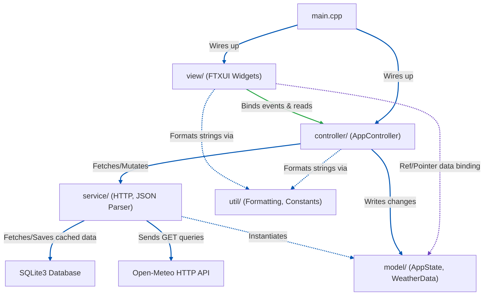

# Quick Weather CLI App Implementation Plan

A low-latency, terminal-based weather forecast utility built with **FTXUI**, fetching data via the **Open-Meteo API** (using **CPR**), parsing JSON with **nlohmann/json**, and implementing a clean **MVC + DDD architecture** similar to `calc-cli`.

This project conforms strictly to the [Google C++ Style Guide](https://google.github.io/styleguide/cppguide.html) with a project-local exception of **4-space indentation**.

---

## 1. Architectural Goals

- **Separation of Concerns**: Strictly divided layers: View (FTXUI presentation), Controller (event routing and coordination), Model (domain entities and TUI state), Service (external API fetching and parsing).
- **Enforced Dependencies**: Build-time dependency checks through separated CMake libraries: View $\rightarrow$ Controller $\rightarrow$ Service/Model $\rightarrow$ Utilities. View cannot bypass the Controller; Controller does not touch FTXUI directly.
- **Asynchronous Data Fetching**: API network calls (HTTP requests via CPR) must run on a background thread so the TUI render loop remains responsive.
- **Offline / Low-Latency Cache**: Use SQLite3 to cache forecasted data locally. Cache queries will have a time-to-live (TTL) check before falling back to network fetches.
- **Independent Testability**: Every component can be compiled and unit tested in isolation using Catch2 (e.g. testing the parser with mock JSON files, testing the controller state machine without FTXUI).

---

## 2. Directory Structure

```
weather-cli/
├── CMakeLists.txt                    # Root build configuration
├── .clang-format                     # Google C++ Style with 4-space indent
├── .gitignore                        # Standard git ignores (build/, CMake cache, IDEs)
├── CLAUDE.md                         # Quick reference commands for AI agents
├── README.md                         # Project description & overview
│
├── docs/
│   └── planning/
│       └── implementation/
│           └── weather-cli-impl-plan.md # This implementation plan
│
├── src/
│   ├── main.cpp                      # App entry point (wires layers, registers custom ftxui loop)
│   │
│   ├── model/                        # Domain entities and TUI state structures
│   │   ├── app_state.hpp             # Shared interactive state (active coordinates, timeline selection, unit settings)
│   │   ├── weather_data.hpp          # Domain entities: Forecast, CurrentWeather, HourlyData, DailyData
│   │   └── weather_data.cpp          # Domain logic definitions
│   │
│   ├── service/                      # Stateless infrastructure services
│   │   ├── http_client.hpp           # Wrapper for HTTP queries using CPR
│   │   ├── http_client.cpp           # Direct fetch methods with error checking
│   │   ├── weather_parser.hpp        # Translates Open-Meteo JSON into weather_data objects
│   │   └── weather_parser.cpp        # Decoupled nlohmann/json mapping
│   │
│   ├── controller/                   # Coordinator layer
│   │   ├── app_controller.hpp        # Controller class coordinating events
│   │   └── app_controller.cpp        # Handles city searches, timeline slider updates, unit toggles
│   │
│   ├── view/                         # FTXUI Views & components
│   │   ├── app.hpp                   # App View class
│   │   ├── app.cpp                   # Main FTXUI layout manager
│   │   ├── weather_icon.hpp          # ASCII art mappings based on WMO codes
│   │   ├── weather_icon.cpp          # Outputs multi-line weather icons
│   │   ├── sparkline_graph.hpp       # Custom canvas renderer for temperatures & rain charts
│   │   └── sparkline_graph.cpp       # FTXUI Canvas graphics plotter
│   │
│   └── util/                         # Static utilities, constants, formatting
│       ├── constants.hpp             # API URLs, default location coordinates (latitude, longitude)
│       ├── formatting.hpp            # Temperature/Wind speed converters, time formattings
│       └── formatting.cpp            # Formatting implementations
│
└── tests/                            # Unit and integration test suites
    ├── test_main.cpp                 # Catch2 runner
    ├── model/                        # Verify weather data entities
    ├── service/                      # Mock parser and API URL builder tests
    ├── controller/                   # Verify AppController handles input actions correctly
    ├── view/                         # Headless event injection verification
    └── util/                         # Formatting utility tests
```

### Layer Reference & Dependency Flow



---

## 3. UI Layout & View Details

The interface will split into four logical rows within FTXUI:
- **Header Control Row**: Search box for location names, unit switcher (Celsius/Fahrenheit toggle), and refresh button.
- **Main Status Row**: Multi-line weather icon in ASCII art, current temperature, description, humidity, and daily High/Low bounds.
- **Graph Visualization Row**: A custom FTXUI `Canvas` drawing line graphs for either temperature trend or precipitation probability.
- **Scrubber Timeline Row**: An interactive FTXUI `Slider` to scrub hourly forecast timelines (0 to 167 hours for 7 days), displaying the detailed weather metric for that selected hour beneath it.

### UI Mockup

```
┌────────────────────────────────────────────────────────┐
│  Quick Weather App - Sydney, AU   [ Refresh ] [ Units ]│ <- Top Header / Control Row
├────────────────────────────────────────────────────────┤
│   .------.      Current: 18.5°C                        │
│  /  /  / |      Condition: Light Rain                  │ <- ASCII Icon & Summary Panel
│   '------'      Wind: 14 km/h  Humidity: 85%           │
│  /  /  /        High: 21.0°C   Low: 12.5°C             │
├────────────────────────────────────────────────────────┤
│  Hourly Temperature Graph (Canvas)                     │
│  24°C ───  /\                                          │
│  20°C ──  /  \    /\                                   │ <- FTXUI Canvas (Sparkline)
│  16°C ─_ /    \__/  \                                  │
│  12°C ─             \______                            │
│        00:00   06:00   12:00   18:00                   │
├────────────────────────────────────────────────────────┤
│  Timeline Slider (Move cursor to scrub hours)          │
│  [ 09:00 ] ──────■───────────────────────────────      │ <- Slider timeline selector
├────────────────────────────────────────────────────────┤
│  Selected Hour Summary (09:00):                        │
│  Temp: 16.2°C  Rain Prob: 60%  Wind: 12km/h            │ <- Timeline details panel
└────────────────────────────────────────────────────────┘
```

---

## 4. CMake Build System Design

To prevent cross-layer leakage, CMake will partition compilation units into isolated libraries, matching the `calc-cli` library layout. To match `calc-cli`, the build system will enforce static linking of all libraries by specifying `STATIC` on all library targets and forcing `set(BUILD_SHARED_LIBS OFF CACHE BOOL "Build shared libraries" FORCE)` in the root configuration.


```cmake
# ---------------------------------------------------------------------------
# Libraries
# ---------------------------------------------------------------------------
# 1. util_lib: formatting and static constants
add_library(util_lib STATIC src/util/formatting.cpp)
target_include_directories(util_lib PUBLIC src/)

# 2. weather_lib: domain models + weather services (HTTP fetching, parsing)
add_library(weather_lib STATIC
    src/model/weather_data.cpp
    src/service/http_client.cpp
    src/service/weather_parser.cpp
)
target_include_directories(weather_lib PUBLIC src/)
target_link_libraries(weather_lib PUBLIC
    util_lib
    cpr::cpr
    nlohmann_json::nlohmann_json
    SQLite3::SQLite3
)

# 3. controller_lib: state machine coordinates
add_library(controller_lib STATIC src/controller/app_controller.cpp)
target_include_directories(controller_lib PUBLIC src/)
target_link_libraries(controller_lib PUBLIC weather_lib util_lib)

# 4. app_lib: view layout components (depends on FTXUI)
add_library(app_lib STATIC
    src/view/app.cpp
    src/view/weather_icon.cpp
    src/view/sparkline_graph.cpp
)
target_include_directories(app_lib PUBLIC src/)
target_link_libraries(app_lib PUBLIC
    ftxui::screen
    ftxui::dom
    ftxui::component
    controller_lib
)

# ---------------------------------------------------------------------------
# Executables
# ---------------------------------------------------------------------------
# Main app executable
add_executable(weather_cli src/main.cpp)
target_link_libraries(weather_cli PRIVATE app_lib)

# Catch2 test runner executable
add_executable(run_tests
    tests/test_main.cpp
    tests/util/test_formatting.cpp
    tests/model/test_weather_data.cpp
    tests/service/test_weather_parser.cpp
    tests/controller/test_app_controller.cpp
    tests/view/test_app.cpp
)
target_link_libraries(run_tests PRIVATE Catch2::Catch2WithMain app_lib controller_lib weather_lib)
```

---

## 5. Development Phases

### Phase 1 — Project Structure and Scaffold Configuration ✅ Done
- [x] Create skeleton folder structure under `src/` and `tests/` directories.
- [x] Set up basic repository configuration files: `.gitignore`, `.clang-format`, `CLAUDE.md`, and `README.md`.
- [x] Configure root `CMakeLists.txt` build configuration.
- [x] (No C++ `.cpp` or `.hpp` files will be created in this phase.)


### Phase 2 — Entry Point Scaffold (`main.cpp` only) ✅ Done
- [x] Create `src/main.cpp` with logic to support three operational modes:
  - [x] **Scenario 1: Headless CLI Parameters**: Accept `--area-code "<zip_or_code>"` and `--country "<country>"` arguments (e.g. `--area-code 2155 --country AUS`) and print the parsed inputs (area code and country) to the console.
  - [x] **Scenario 2: Headless Stdin Pipe**: Check if stdin is a pipe (`!isatty(STDIN_FILENO)`) and parse space-separated area and country values (e.g. `echo 2155 AUS | weather-cli`) and print the parsed inputs to the console.
  - [x] **Scenario 3: Interactive TUI (Stub)**: Fallback to launching an interactive FTXUI screen with a basic menu layout containing only a "Quit" option.
- [x] Temporarily configure root `CMakeLists.txt` to compile `src/main.cpp` directly, linking it only to FTXUI for bootstrapping (commenting out or excluding libraries that don't exist yet).
- [x] (No other C++ `.cpp` or `.hpp` source files will be created in this phase.)


### Phase 3 — TUI Outline Layout Setup (`AppState`, `AppController`, `App` View only) (Current Phase)
- [ ] Implement `src/model/app_state.hpp` defining the TUI state model (active coordinates, units configuration, active tab selection, scrubber indices).
- [ ] Implement `src/controller/app_controller.hpp` and `src/controller/app_controller.cpp` coordinating core user actions (toggling Celsius/Fahrenheit, shifting tab selects, scrubbing timeline indices, exiting the loop).
- [ ] Implement `src/view/app.hpp` and `src/view/app.cpp` building the visual wireframe:
  - Top horizontal menu bar with options (Refresh, Units, Quit).
  - Status banner showing mock city details.
  - Summary row printing static condition text and mock ASCII icon clouds.
  - View selectors for Temperature and Rain Probability graphs.
  - A static FTXUI Canvas rendering horizontal lines to mockup the plotting area.
  - Interactive slider timeline that scrubs indices (0 to 23).
  - An hourly details box updating text metrics dynamically based on the active slider index.
- [ ] Define the library targets (`util_lib`, `controller_lib`, `app_lib`) in `CMakeLists.txt` and link `weather_cli` executable to `app_lib`.
- [ ] (No geocoding, HTTP network requests, parsing libraries, databases, custom canvas plotters, or WMO descriptions will be built in this phase. The UI components will render static mocked content.)

### Phase 4 — Service & Model Layer Setup
- [ ] Implement `src/model/weather_data.hpp` and `src/model/weather_data.cpp` structs.
- [ ] Implement `src/service/weather_parser.hpp/cpp` parsing functions with associated JSON test vectors.
- [ ] Set up `src/service/http_client.hpp/cpp` queries with query URL composition.
- [ ] Incorporate Catch2 verification tests for JSON parses and data caching.
- [ ] Define the `weather_lib` target in `CMakeLists.txt`.

### Phase 5 — Visual Component Integration (ASCII Icon & Sparkline Plotter)
- [ ] Implement multi-line ASCII art rendering in `src/view/weather_icon.hpp/cpp` and replace the static mock cloud text in `app.cpp`.
- [ ] Develop dynamic line plotting in `src/view/sparkline_graph.hpp/cpp` using FTXUI `Canvas` drawing APIs and wire it to replace the static diagnostic line.
- [ ] Wire location search query suggestions list input in view and controller.

### Phase 6 — System Integration & Verification
- [ ] Update `src/main.cpp` to fully wire the real views, controllers, services, and state models.
- [ ] Fully configure final target linkages in `CMakeLists.txt`.
- [ ] Run the complete build pipeline and verify all unit/integration tests pass.
- [ ] Code formatting check using Clang-Format verification.


