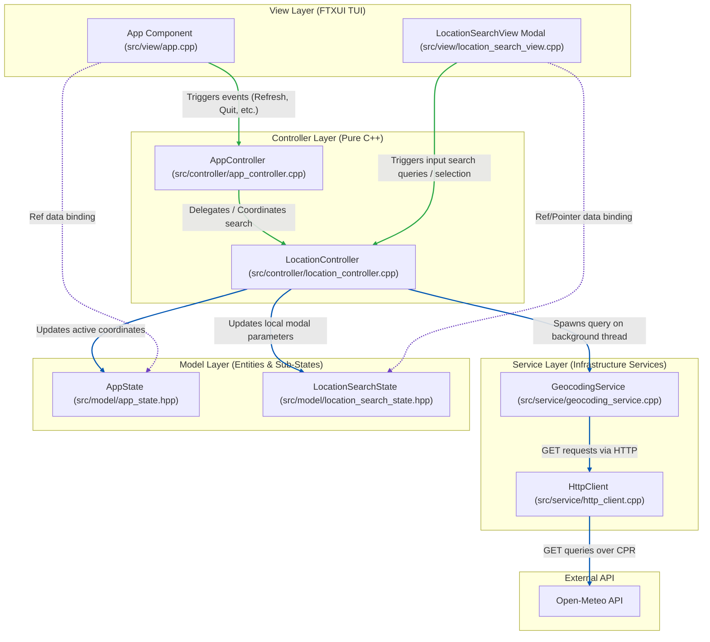
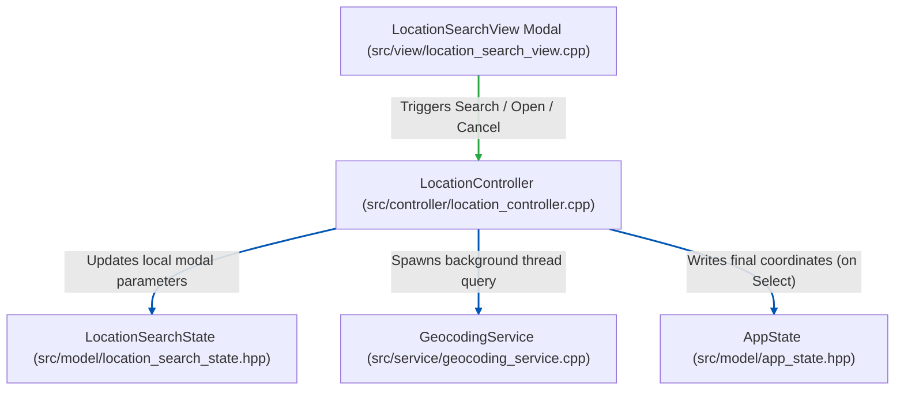
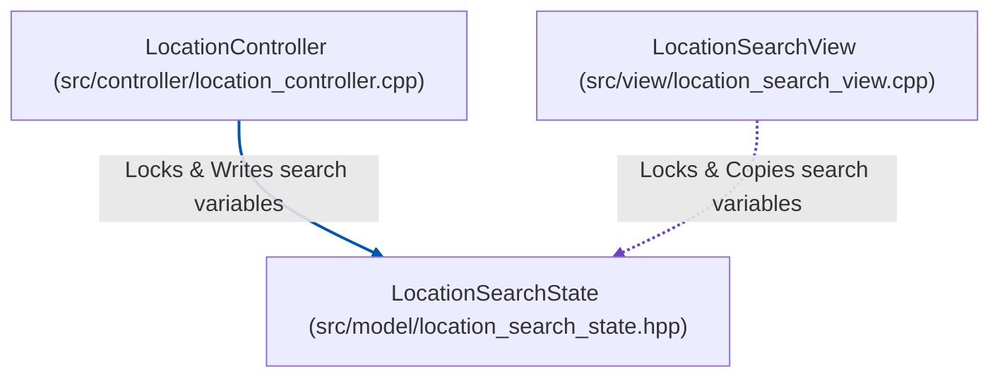

# Architecture & Separation of Concerns

This document details the architectural layers of the `weather-cli` TUI application and how they interact, illustrating the separation of concerns between Model, View, and Controller layers, as well as the threading boundaries of asynchronous tasks.

---

## 1. Interaction Diagram

Below is a detailed diagram showing the data flow, focus handling, thread safety, and dependencies across all application layers and components.

---

## 2. Separation of Concerns Breakdown

### View Layer (FTXUI TUI)
* **Components**: [app.cpp](../src/view/app.cpp) and [location_search_view.cpp](../src/view/location_search_view.cpp).
* **Role**: Orchestrates visual elements and coordinates TUI layout construction, borders, menus, custom temperature trend canvas, and focus transitions.
* **Separation Rule**: **No business logic, thread management, or network queries.** The View does not execute background threads or interact with the Geocoding API directly. Actions (like navigation clicks or typing autocomplete queries) are delegated immediately to the Controllers. The views observe data models reactively via pointer binding.

### Controller Layer (Pure C++)
Coordinating tasks are split hierarchically between the central application coordinator (parent) and sub-controllers:
* **AppController** ([app_controller.cpp](../src/controller/app_controller.cpp)):
  The root controller. It coordinates main application tab selections, unit conversions (Celsius vs. Fahrenheit), slider scrub indices, presets, and the main event loop termination (Quit). It accepts a reference to `LocationController` in its constructor, delegating search events and providing access to it for child views.
* **LocationController** ([location_controller.cpp](../src/controller/location_controller.cpp)):
  A child controller. It owns the lifecycle of the search dialog model (`LocationSearchState`), controls text search queries, manages asynchronous worker threads, and writes final location decisions to the global state.
* **Separation Rule**: **Zero TUI/FTXUI library dependencies.** The controllers contain no terminal drawing layouts, colors, styles, screen elements, or custom key definitions. They compile and run under standard unit testing suites without any user interface dependency.

### Service Layer (Pure C++ Domain Services)
* **GeocodingService** ([geocoding_service.cpp](../src/service/geocoding_service.cpp)):
  Formulates REST endpoints for the Open-Meteo search queries and parses incoming JSON payload data into clean model structures.
* **HttpClient** ([http_client.cpp](../src/service/http_client.cpp)):
  Stateless HTTP retrieval wrapper over the CPR request client.
* **Separation Rule**: **Stateless & logic-focused.** Services are completely unaware of dashboard state lifecycles, active slider views, or terminal focus configurations. They take clean parameters, query remote networks, parse arrays, and propagate runtime exceptions.

### Model Layer (Pure C++ Entities & States)
* **AppState** ([app_state.hpp](../src/model/app_state.hpp)):
  Global structure containing application-wide dashboard state (latitude, longitude, active city name, temperature units, selected timeline hour index, etc.).
* **LocationSearchState** ([location_search_state.hpp](../src/model/location_search_state.hpp)):
  Encapsulated sub-state containing transient geocoding dialog fields (active keystroke search query, matches suggestion array, loader checks, error messages, and its local synchronization mutex).
* **Separation Rule**: **Pure data representations.** Models store configuration values, properties, and entity maps. They contain no event processing loops, console layouts, or network handlers.

---

## 3. Sub-Controller Deep Dives

While the main Interaction Diagram shows the global layout, this section details the focused responsibilities and interaction flows of the location search modal, starting from the initiating Views that trigger the actions.

### A. LocationSearchController Flow

The `LocationController` mediates geocoding query operations between user inputs in the UI and the asynchronous background worker thread.

* **Flow & Responsibilities**:
  * **Trigger**: The user types text in the modal input box or selects a suggestion inside the `LocationSearchView` overlay.
  * **Routing**: The view triggers query callbacks on `LocationController`.
  * **Action**: 
    * `Search()` writes query changes to `LocationSearchState` and delegates HTTP geocoding calls to a background thread.
    * `SelectSuggestion()` writes coordinates to `AppState` (synchronizing the main dashboard), clears search variables, and shuts down the modal.
    * `CancelSearch()` resets temporary search state and closes the dialog cleanly.

---

## 4. State Layer & Thread Safety Deep Dives

This section details how application state and database transactions are encapsulated within the Model layer, and how they remain isolated from UI logic.

### A. LocationSearchState (Asynchronous Thread Synchronization)

`LocationSearchState` isolates transient variables used during live search queries. Because search queries are executed asynchronously on a background worker thread while the main drawing thread repaints the TUI screen, a local mutex (`mutex`) protects these variables from concurrent modification data races.

* **Responsibilities & Binding**:
  * **Decoupled Storage**: Holds visibility flags (`show_search_modal`), raw search query text, geocoding suggestion matches, and loading or error properties.
  * **Thread Safety**: 
    * The **background worker thread** spawned by `LocationController` locks `mutex` before writing query results, clearing lists, or setting loading flags.
    * The **main drawing thread** inside `LocationSearchView` locks `mutex` briefly at the start of its render pass, copying all transient fields to local variables before releasing the lock and drawing. This completely eliminates concurrent access data races on `std::vector` and `std::string` (which would otherwise corrupt memory pointers and freeze the terminal event loop).

---

## 5. Appendix: Diagram Style Guide

This appendix serves as a behavioral reference for maintaining architecture diagrams within this repository.

### A. Color Key

| Color | Hex Code | Meaning / Usage | Example |
|---|---|---|---|
| **Green** | `#28a745` | Events and callback triggers | `App --> AppCtrl`, `LocView --> LocCtrl` |
| **Purple** | `#6f42c1` | Data binding / Read copies | `App -.-> State`, `LocView -.-> SearchState` |
| **Darker Blue** | `#0056b3` | All other lines (delegation, databases, API queries) | `LocCtrl --> SearchState`, `Http --> OpenMeteo` |
| **Monochrome** | *Standard* | Structural borders, groups, components | `subgraph View` |

### B. Strict UML Standards
* **Dependency Rule**: Arrows must always point from the **Client** (the component holding the reference or triggering the event) to the **Supplier** (the component being referenced or serving the request).
* **Reference Direction**: Data binding references (like `ftxui::Ref` bindings) must point from the View/Component observing the value to the State/Repository model holding the value (e.g., `App -.-> State`).

### C. Mermaid linkStyle Indices
When adding or updating connections in diagrams:
1. Determine the 0-based index of the connection by counting the sequential declaration of all arrows (e.g. `-->`, `-.->`) in the Mermaid code block.
2. Apply styles at the bottom of the block using `linkStyle <indices> stroke:#<hex>,stroke-width:2px;`.
