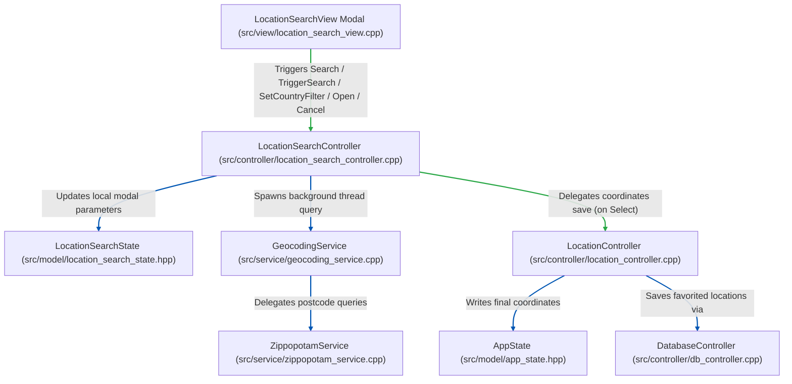
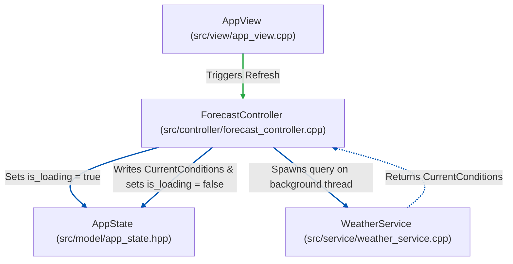
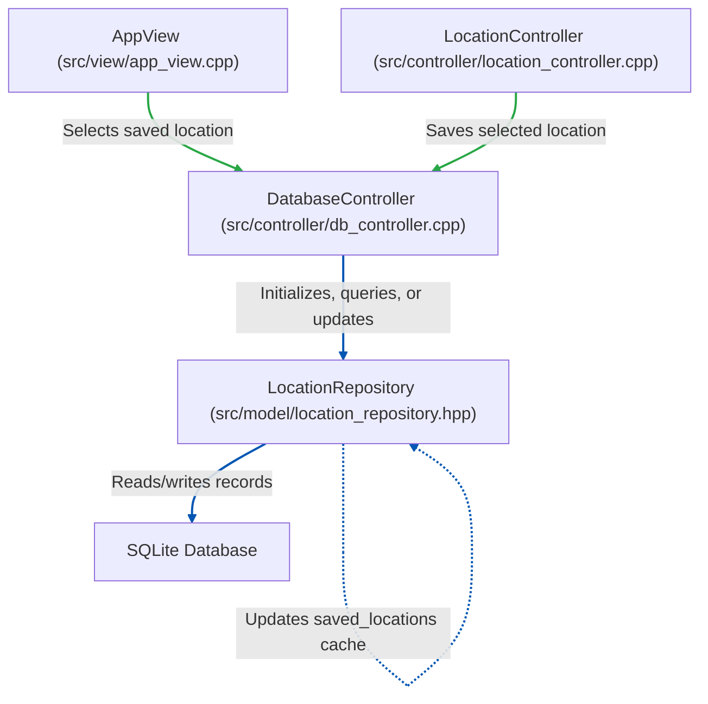
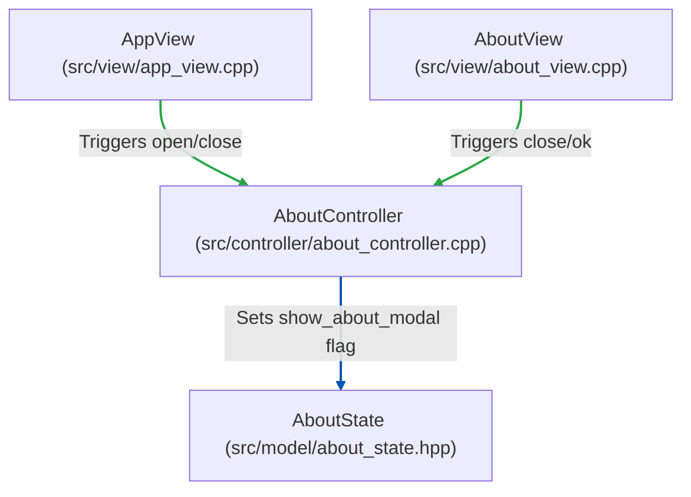
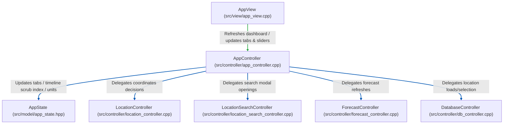
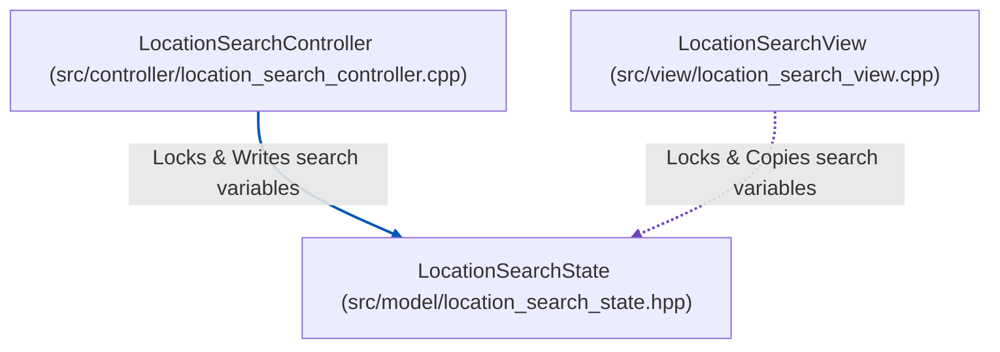

# Architecture & Separation of Concerns

This document details the architectural layers of the `weather-cli` TUI application and how they interact, illustrating the separation of concerns between Model, View, and Controller layers, as well as the threading boundaries of asynchronous tasks.

---

## 1. Interaction Diagram

Below is a detailed diagram showing the data flow, focus handling, thread safety, and dependencies across all application layers and components.

```mermaid
graph TD
    %% Layers Definition
    subgraph View ["View Layer (FTXUI TUI)"]
        AppView["AppView Component (src/view/app_view.cpp)"]
        LocView["LocationSearchView Modal (src/view/location_search_view.cpp)"]
        AboutView["AboutView Modal (src/view/about_view.cpp)"]
        WeatherIconView["WeatherIcon (src/view/weather_icon.cpp)"]
    end

    subgraph Controller ["Controller Layer (Pure C++)"]
        AppCtrl["AppController (src/controller/app_controller.cpp)"]
        LocCtrl["LocationController (src/controller/location_controller.cpp)"]
        SearchCtrl["LocationSearchController (src/controller/location_search_controller.cpp)"]
        AboutCtrl["AboutController (src/controller/about_controller.cpp)"]
        DbCtrl["DatabaseController (src/controller/db_controller.cpp)"]
        ForecastCtrl["ForecastController (src/controller/forecast_controller.cpp)"]
    end

    subgraph Service ["Service Layer (Infrastructure Services)"]
        Geocoding["GeocodingService (src/service/geocoding_service.cpp)"]
        Zippopotam["ZippopotamService (src/service/zippopotam_service.cpp)"]
        WeatherServ["WeatherService (src/service/weather_service.cpp)"]
        Http["HttpClient (src/service/http_client.cpp)"]
    end

    subgraph Model ["Model Layer (Entities & Sub-States)"]
        State["AppState (src/model/app_state.hpp)"]
        SearchState["LocationSearchState (src/model/location_search_state.hpp)"]
        AboutState["AboutState (src/model/about_state.hpp)"]
        Repo["LocationRepository (src/model/location_repository.hpp)"]
    end

    subgraph Storage ["Local Storage"]
        Sqlite["SQLite Database (weather_cache.db)"]
    end

    subgraph External ["External API"]
        OpenMeteo["Open-Meteo API"]
        Zippopotamus["Zippopotam.us API"]
    end

    %% Interactions
    App -->|"Triggers events (Refresh, Quit, etc.)"| AppCtrl
    AppCtrl -->|"Delegates coordinates actions"| LocCtrl
    AppCtrl -->|"Delegates about dialog"| AboutCtrl
    AppCtrl -->|"Delegates saved location selection"| DbCtrl
    AppCtrl -->|"Delegates forecast refresh"| ForecastCtrl
    AppCtrl -->|"Delegates search modal openings"| SearchCtrl
    LocView -->|"Triggers Search / TriggerSearch / SetCountryFilter"| SearchCtrl
    AboutView -->|"Triggers dialog dismissal"| AboutCtrl
    SearchCtrl -->|"Delegates selection on Select"| LocCtrl
    LocCtrl -->|"Updates active coordinates"| State
    SearchCtrl -->|"Updates local modal parameters"| SearchState
    AboutCtrl -->|"Updates about visibility"| AboutState
    ForecastCtrl -->|"Updates weather & loading"| State
    SearchCtrl -->|"Spawns query on background thread"| Geocoding
    ForecastCtrl -->|"Spawns query on background thread"| WeatherServ
    Geocoding -->|"Delegates postcode queries"| Zippopotam
    Geocoding -->|"GET requests via HTTP"| Http
    Zippopotam -->|"GET requests via HTTP"| Http
    WeatherServ -->|"GET requests via HTTP"| Http
    Http -->|"GET queries over CPR"| OpenMeteo
    Http -->|"GET queries over CPR"| Zippopotamus
    DbCtrl -->|"Initializes & queries/saves"| Sqlite
    DbCtrl -->|"Loads / populates"| Repo
    LocCtrl -->|"Saves favorited locations via"| DbCtrl

    %% Data Binding (Reversed to match strict UML dependency direction)
    App -.->|"Ref data binding (read cc & coords)"| State
    LocView -.->|"Ref/Pointer data binding"| SearchState
    AboutView -.->|"Ref/Pointer data binding"| AboutState
    App -.->|"Ref/Pointer data binding"| Repo

    %% Style Event Arrows Green
    linkStyle 0,1,2,3,4,5,6,7,8 stroke:#28a745,stroke-width:2px;

    %% Style All Other Flow Lines Darker Blue
    linkStyle 9,10,11,12,13,14,15,16,17,18,19,20,21,22,23 stroke:#0056b3,stroke-width:2px;

    %% Style Data Binding Arrows Purple
    linkStyle 24,25,26,27 stroke:#6f42c1,stroke-width:2px;
```

---

## 2. Separation of Concerns Breakdown

### View Layer (FTXUI TUI)
* **Components**: [app_view.cpp](../src/view/app_view.cpp), [location_search_view.cpp](../src/view/location_search_view.cpp), [about_view.cpp](../src/view/about_view.cpp), and [weather_icon.cpp](../src/view/weather_icon.cpp).
* **Role**: Orchestrates visual elements and coordinates TUI layout construction, borders, menus, custom canvas drawings, modals, and focus transitions. Translates weather metrics and WMO interpretation codes to UI descriptors and multi-line ASCII graphics.
* **Separation Rule**: **No business logic, thread management, or network queries.** The View does not execute background threads or interact with the APIs directly. User interactions are immediately forwarded to Controllers. Views observe and bind reactively to the model states.

### Controller Layer (Pure C++)
Coordinating tasks are split hierarchically between the central application coordinator (parent) and sub-controllers:
* **AppController** ([app_controller.cpp](../src/controller/app_controller.cpp)):
  The root coordinator. It binds dashboard tab selections, unit conversions (Celsius vs. Fahrenheit), scrubber sliders, and coordinate saves. It references `LocationController`, `LocationSearchController`, `AboutController`, `ForecastController`, and `DatabaseController` in its constructor, exposing them hierarchically to layout views.
* **LocationSearchController** ([location_search_controller.cpp](../src/controller/location_search_controller.cpp)):
  A child controller. It manages the locations search modal state (`LocationSearchState`), controls text queries, coordinates the country filter dropdown selections, resets modal variables, and dispatches geocoding HTTP searches onto background threads.
* **LocationController** ([location_controller.cpp](../src/controller/location_controller.cpp)):
  A core controller. It coordinates active coordinates choices and city names in the global `AppState` and delegates favorite database saves to `DatabaseController`.
* **ForecastController** ([forecast_controller.cpp](../src/controller/forecast_controller.cpp)):
  A child controller. It coordinates retrieving live weather forecast conditions. It sets the loading flags and detaches asynchronous background threads to invoke weather services, writing the final `CurrentConditions` into `AppState`.
* **AboutController** ([about_controller.cpp](../src/controller/about_controller.cpp)):
  A child controller. It toggles the visibility flag of the application's Version details dialog.
* **DatabaseController** ([db_controller.cpp](../src/controller/db_controller.cpp)):
  A child controller. It initializes the SQLite db database connection, loads saved items cache, and persists selected locations.
* **Separation Rule**: **Zero TUI/FTXUI library dependencies.** Controllers contain no rendering code, terminal layout rules, colors, fonts, or input key bindings. They compile and run under Catch2 unit tests in a completely headless console environment.

### Service Layer (Pure C++ Domain Services)
* **GeocodingService** ([geocoding_service.cpp](../src/service/geocoding_service.cpp)):
  A router facade for location resolving. Translates city searches to Open-Meteo API query requests and redirects postcode lookups to `ZippopotamService`.
* **ZippopotamService** ([zippopotam_service.cpp](../src/service/zippopotam_service.cpp)):
  Composes postcode query requests to the `api.zippopotam.us` endpoint.
* **WeatherService** ([weather_service.cpp](../src/service/weather_service.cpp)):
  Formulates request URLs, handles query execution, and parses JSON parameters into domain forecast entities (`CurrentConditions`).
* **HttpClient** ([http_client.cpp](../src/service/http_client.cpp)):
  A stateless wrapper over CPR for making HTTP GET queries.
* **Separation Rule**: **Stateless & logic-focused.** Services are completely unaware of modal state toggles, active focus contexts, or redraw loops. They query endpoints, parse returned payloads, and propagate parse exceptions.

### Model Layer (Pure C++ Entities & States)
* **AppState** ([app_state.hpp](../src/model/app_state.hpp)):
  Global structure containing application-wide dashboard state (latitude, longitude, active city name, temperature units, selected timeline hour index, and the current forecastConditions optional).
* **LocationSearchState** ([location_search_state.hpp](../src/model/location_search_state.hpp)):
  Encapsulated sub-state containing transient geocoding dialog fields (active keystroke search query, matches suggestion array, loader checks, error messages, and its local synchronization mutex).
* **AboutState** ([about_state.hpp](../src/model/about_state.hpp)):
  Encapsulated sub-state containing the visibility flag of the About modal overlay.
* **LocationRepository** ([location_repository.hpp](../src/model/location_repository.hpp)):
  Database-backed repository model. It encapsulates the SQLite connection handle (`sqlite3* db_`) and coordinates reading and writing favorite locations.
* **WeatherData** ([weather_data.hpp](../src/model/weather_data.hpp)):
  Pure domain model representations (`CurrentConditions` structure).
* **Separation Rule**: **Pure data representations.** Models store configuration values, properties, and entity maps. They contain no event processing loops, console layouts, or network handlers.

---

## 3. Sub-Controller Deep Dives

### A. LocationSearchController Flow

The `LocationSearchController` mediates geocoding query operations between user inputs in the UI and the asynchronous background worker thread, delegating selection to the core `LocationController`.

* **Flow & Responsibilities**:
  * **Trigger**: The user types text, clicks the Search button, presses Enter on the input box, or changes the country filter inside the `LocationSearchView` overlay.
  * **Routing**: The view triggers query callbacks on `LocationSearchController`.
  * **Action**: 
    * `Search()` and `TriggerSearch()` clear previous suggestions, write query changes to `LocationSearchState` under lock, trigger an immediate UI redraw to show the loading screen, and delegate HTTP geocoding calls to a background thread.
    * `SetCountryFilter()` mutates search filter constraints and re-fires the search query reactive updates.
    * `SelectSuggestion()` extracts coordinates, delegates them to `LocationController` to save/apply changes, resets search state, and closes the modal dialog.
    * `CancelSearch()` resets temporary search state and closes the dialog cleanly.

---

### B. ForecastController Flow

The `ForecastController` coordinates fetching current weather metrics from the Open-Meteo API on startup and whenever a manual refresh is requested.

* **Flow & Responsibilities**:
  * **Trigger**: Manual click on the "Refresh" button in `App` view, or programmatic refresh on startup in `main.cpp`.
  * **Routing**: The view or main loop invokes `Refresh()` on `ForecastController`.
  * **Action**:
    * `Refresh()` locks `AppState` and sets `is_loading = true`.
    * Spawns an asynchronous background worker thread. To prevent network race conditions, an atomic sequence counter checks if the response corresponds to the latest requested fetch ID before writing results.
    * Calls `WeatherService::FetchCurrentConditions(lat, lon)`.
    * If successful, writes `CurrentConditions` into `AppState`, resets `is_loading = false`, and triggers a redraw. If it throws/fails, cleans loading flags and triggers a redraw.

---

### C. DatabaseController Flow

The `DatabaseController` coordinates reading and writing favorite locations to local persistent storage.

* **Flow & Responsibilities**:
  * **Trigger**: The user selects a previously saved location from the header dropdown, or checks the "Save location to database" box while selecting a suggestion in the search modal.
  * **Routing**: Invokes `SelectSavedLocation()` on `AppController` (delegating to `DatabaseController`) or selects suggestions in `LocationSearchController` (which delegates saving to `LocationController` which then delegates to `DatabaseController`).
  * **Action**:
    * `DatabaseController` coordinates SQLite actions by delegating tasks to `LocationRepository`.
    * `LocationRepository` compiles and formats SQL statements, communicates with `Sqlite`, updates the in-memory cache vector (`saved_locations`), and returns control.
    * `DatabaseController` triggers a redraw to update the dropdown list contents reactively.

---

### D. AboutController Flow

The `AboutController` manages toggling the application information modal layer.

* **Flow & Responsibilities**:
  * **Trigger**: Clicking the "About" button in the menu, or pressing Esc/Enter on the about overlay modal.
  * **Routing**: Views invoke `ToggleAbout()` or `CloseAbout()` on `AboutController`.
  * **Action**:
    * Updates `AboutState.show_about_modal` to `true` or `false` and triggers a redraw immediately.

---

### E. AppController Flow

The `AppController` coordinates parent coordinator tasks and mediates between main components.

* **Flow & Responsibilities**:
  * **Trigger**: Navigation tab changes, scrubber slider shifts, Celsius/Fahrenheit toggle presses.
  * **Routing**: Main UI view routes user interaction events to `AppController`.
  * **Action**:
    * Modifies units parameters or scrubber indices on the global `AppState` directly.
    * Delegates sub-dialog opening/refresh triggers hierarchically to `LocationController`, `LocationSearchController`, `ForecastController`, and `DatabaseController`.

---

## 4. State Layer & Thread Safety Deep Dives

### A. LocationSearchState (Asynchronous Thread Synchronization)

`LocationSearchState` isolates transient variables used during live search queries. Because search queries are executed asynchronously on a background worker thread while the main drawing thread repaints the TUI screen, a local mutex (`mutex`) protects these variables from concurrent modification data races.

* **Responsibilities & Binding**:
  * **Decoupled Storage**: Holds visibility flags (`show_search_modal`), raw search query text, geocoding suggestion matches, and loading or error properties.
  * **Thread Safety**: 
    * The **background worker thread** spawned by `LocationSearchController` locks `mutex` before writing query results, clearing lists, or setting loading flags.
    * The **main drawing thread** inside `LocationSearchView` locks `mutex` briefly at the start of its render pass, copying all transient fields to local variables before releasing the lock and drawing. This completely eliminates concurrent access data races on `std::vector` and `std::string` (which would otherwise corrupt memory pointers and freeze the terminal event loop).

---

## 5. Appendix: Diagram Style Guide

This appendix serves as a behavioral reference for maintaining architecture diagrams within this repository.

### A. Color Key

| Color | Hex Code | Meaning / Usage | Example |
|---|---|---|---|
| **Green** | `#28a745` | Events and callback triggers | `App --> AppCtrl`, `LocView --> LocCtrl` |
| **Purple** | `#6f42c1` | Data binding / Read copies | `App -.-> State`, `LocView -.-> SearchState` |
| **Darker Blue** | `#0056b3` | All other lines (delegation, databases, API queries) | `LocCtrl --> SearchState`, `Http --> OpenMeteo` |
| **Monochrome** | *Standard* | Structural borders, groups, components | `subgraph View` |

### B. Strict UML Standards
* **Dependency Rule**: Arrows must always point from the **Client** (the component holding the reference or triggering the event) to the **Supplier** (the component being referenced or serving the request).
* **Reference Direction**: Data binding references (like `ftxui::Ref` bindings) must point from the View/Component observing the value to the State/Repository model holding the value (e.g., `App -.-> State`).

### C. Mermaid linkStyle Indices
When adding or updating connections in diagrams:
1. Determine the 0-based index of the connection by counting the sequential declaration of all arrows (e.g. `-->`, `-.->`) in the Mermaid code block.
2. Apply styles at the bottom of the block using `linkStyle <indices> stroke:#<hex>,stroke-width:2px;`.
